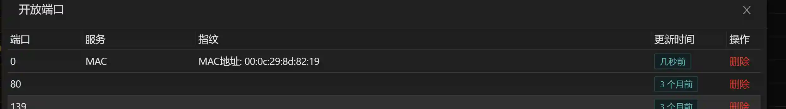

# Intranet ARP scanning

# Main functions

ARP scan of the target intranet, all ARP requests and reply to the target intranet.

ARP messages only prove that this host is alive and will not detect the port. If other modules need to connect to the discovered host, please use Session to add the corresponding
route or Socks proxy.

Please note that most ARP messages are limited to the same router, which means that ARP scans cannot cross routers.

# How to operate

