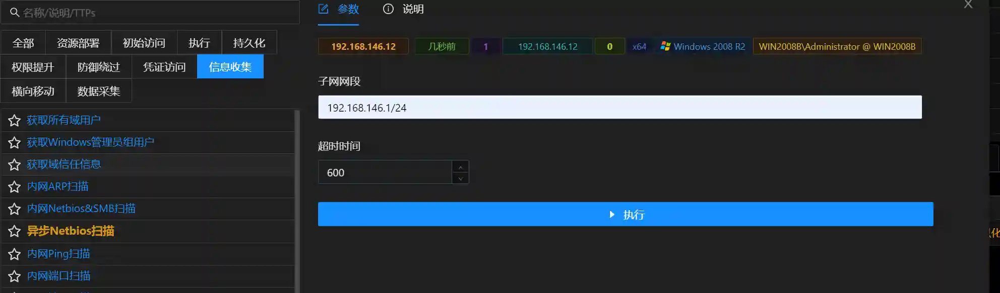

# Asynchronous Netbios scanning

# Main functions

Intranet asynchronous netbios scanning based on nextnet.

The module scans the host of the subnet to open the netbios protocol (port 137) and obtains the host's network card address.

The module is mainly used to find targets in intranets with multiple network segments.

# How to operate

