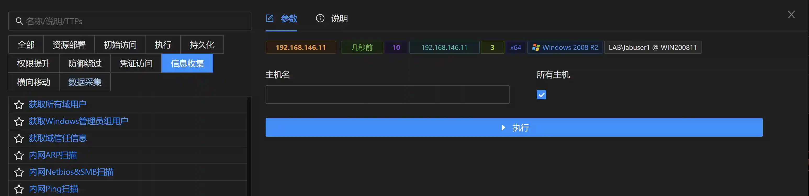

# Get the IP information of the domain host

# Main functions

The IP address of the controlled host is collected by default. If you need to collect other hosts in the domain, such as domain control or other domain user IP, please enter the
host name as the parameter

# How to operate

