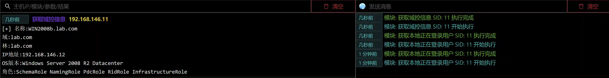

# Obtain domain control information

# Main functions

The module uses powershell script to obtain domain control information of the domain where the host is located. If the host is not in the domain, the script may report an error.

# How to operate

