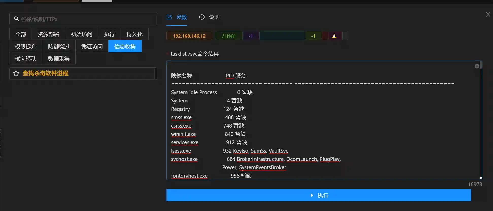
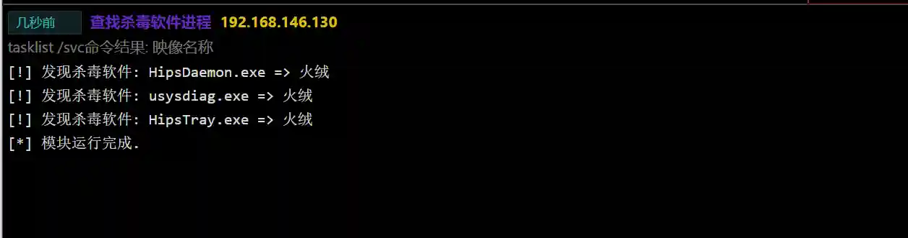

# Find antivirus software processes

# Main functions

The module obtains the information of the installed antivirus software in the system by comparing tasklist /svc with known data.

Execute tasklist /svc through the webshell command execution function, and then copy the result to the input box to run

# How to operate

+ Execute using webshell

```plain
tasklist /svc
```

+ Run the module and fill in the results






