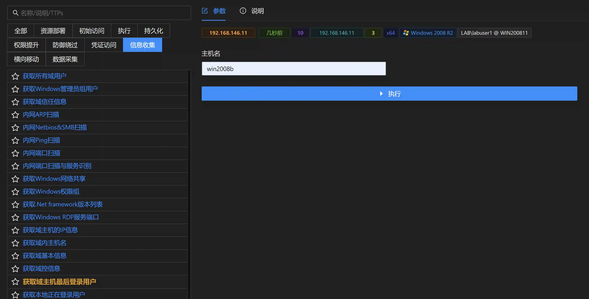

# Get the last logged-in user on the domain host

# Main functions

The module obtains the user information of the last logged-in of the remote host in the domain. The module requires ordinary domain user permissions, but the remote host needs to
enable the remote registration function. The host name can be obtained using the `Get information of all domain hosts` module.

# How to operate

