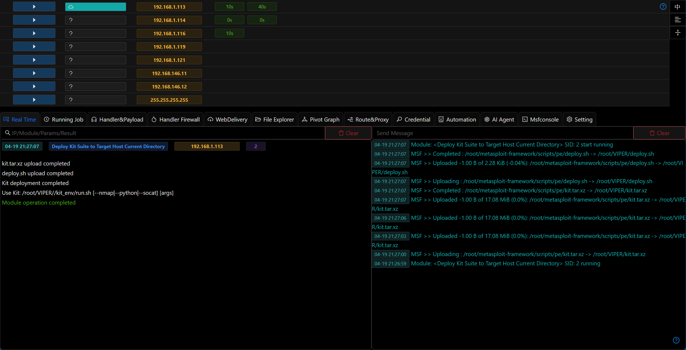
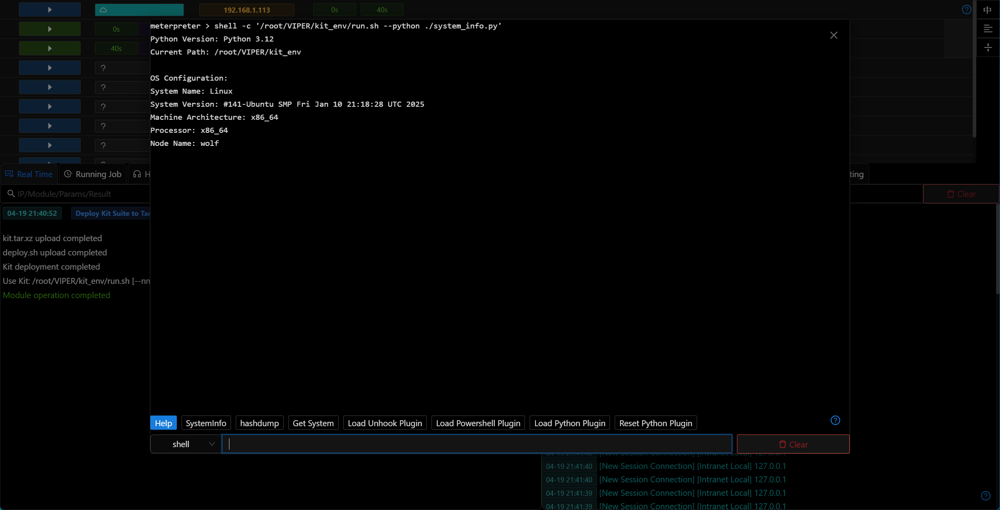
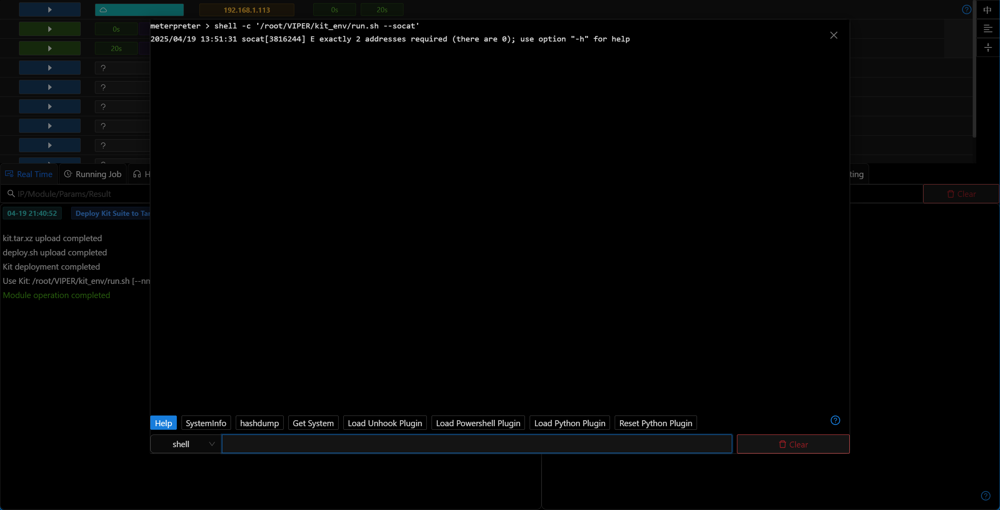

# Deploy Kit Package to Linux Host

## Main Features

The Kit package currently includes the following tools:

- nmap (includes fingerprint identification/OS detection)
- python3.12 (includes impacket)
- socat

## Operation Method

- After the module is executed successfully, you can use the tools in the kit package on the target host
- After the Kit package is deployed, it will automatically add the Python Interpreter to the host information, which can be viewed in the host information. When running related modules, this Python Interpreter will be used automatically

- nmap

- python3.12

- socat

