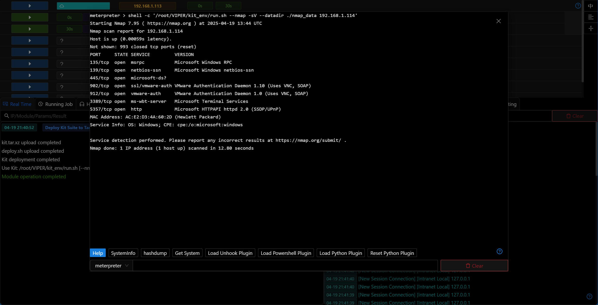

# Deploy Kit Suite to Target Host

## Main Features

The Kit suite currently includes the following tools:

- nmap (includes fingerprint identification/OS detection)
- python3.12 (includes impacket)
- socat

## Operation Method

- After successful module execution, you can run the tools from the kit suite on the target host
- nmap

- python3.12

- socat

