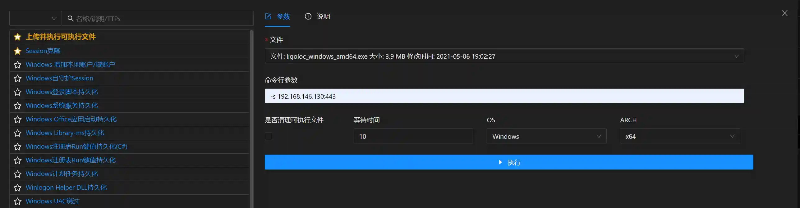

# Upload and execute executable files

# Main functions

Upload the user-specified file to the target machine and execute.

Function and in`文件管理`The logic of uploading files and executing them is the same, and the module is mainly`自动编排`The functions are used in conjunction with each other, and
the usage scenarios are as follows:

+ Generate a listener and deliver the listener's payload to the target via spear phishing email
+ `自动编排`Add this module to it and specify a binary file (such as ligolo, frp, nps and other intranet penetration tools or customized Trojans, etc.)
+ When permission is available, the binary file will be automatically uploaded to the target machine and executed

# How to operate

Introduction and combination`自动编排`How to use

+ On`自动编排`Add this module to

+ Please note that two module configurations are added to the operation, representing the files that need to be uploaded and executed by Windows type permissions and Linux type
  permissions.

+ The actual operation effect of the above configuration: If the newly added permission is a Windows system, the first configuration check will not be passed and will be
  automatically skipped, and the second configuration will take effect. If the permissions of the Linux system are online, the same is true, the first configuration will take
  effect, and the second configuration will not be passed.

