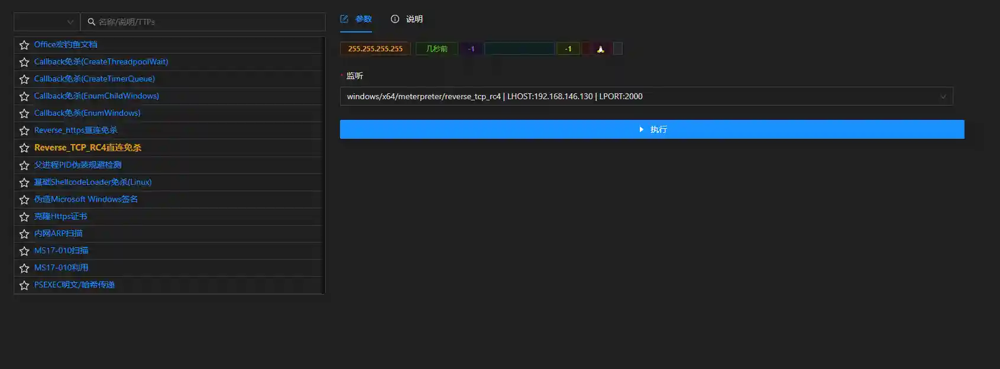

# Reverse_TCP_RC4 direct connection without killing

# Main functions

Generate kill-free exe

# How to operate

+ Create a new reverse_tcp_rc4 listening
+ Open the module and select the corresponding rc4 monitoring
+ After running the module, it will be in`文件管理`Generate a zip file, containing the free kill exe payload and corresponding C++ code

