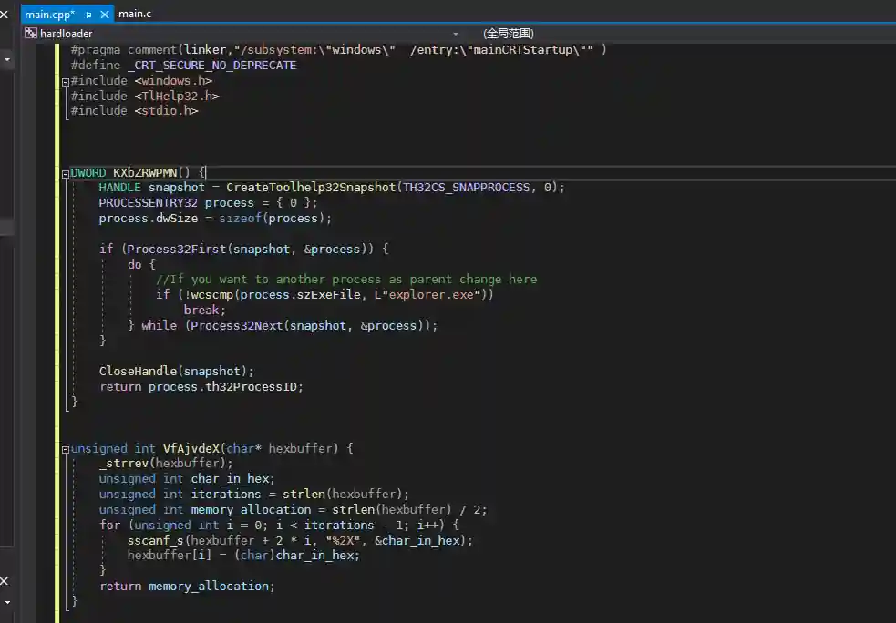

# Parent process PID disguise evasion detection

# Main functions

The module generates an exe file with payload, and automatically migrates it to the ie process after execution, and disguises the parent process (PPID) as explorer.exe (explore
manager)

# How to operate

+ Open the module, select Listen, run
+ Generate cpp source code and download source code

+ Download the source code and use Visual Studio to compile the source code

> Viper's built-in compiler is Mingw64. The effect of free killing is poor when compiling this module, so the source code user can compile it by themselves.
>

+ Upload to the target host and run

+ Effect when the exe generated by this module is online using webshell

You can see that the payload process is ie and the parent process is iexplore.exe. You can have limited defense AV detection and blue team traceability.

+ Comparative test, when using webshell to run the exe generated by other unkilled modules online

You can see that the parent process of payload is cmd.exe (ice scorpion)

