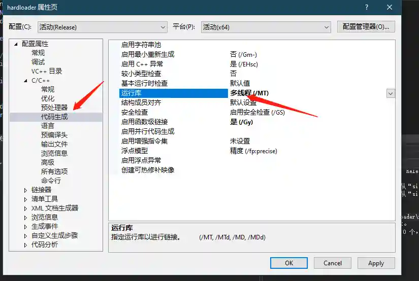

# Parent Process PID Spoofing for Detection Evasion

The module generates an exe file with payload that automatically migrates to the IE process after execution and spoofs its parent process (PPID) as explorer.exe (Windows Explorer).

# Operation Method

+ Open the module, select a listener, and run
+ Generate and download the CPP source code

+ Download the source code and compile it using Visual Studio

> Viper's built-in compiler is Mingw64, which has poor anti-detection results when compiling this module. Therefore, the source code is provided for users to compile themselves.
>

+ Upload and run on the target machine

+ Effect when running the module-generated exe through webshell:

As shown, the payload process is IE with iexplore.exe as the parent process. This provides limited protection against AV detection and blue team tracing.

+ Comparison test: Effect when running exe generated by other anti-detection modules through webshell:

As shown, the payload's parent process is cmd.exe (Behinder)