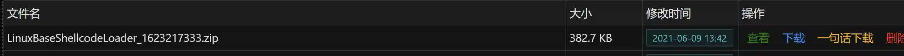

# Anti-detection of Basic ShellcodeLoader (Linux)

Generate anti-detection ELF

## Operation Method
+ Create a new listener (Linux)
+ Open the module and select the corresponding listener
+ After running the module, a ZIP file will be generated in "File Management", which contains the anti-detection ELF payload and the corresponding C++ code

# Note
The module is currently only compatible with the following payloads:

linux/x86/meterpreter/reverse_tcp 

linux/x86/meterpreter/bind_tcp

linux/x64/meterpreter/reverse_tcp

linux/x64/meterpreter/bind_tcp