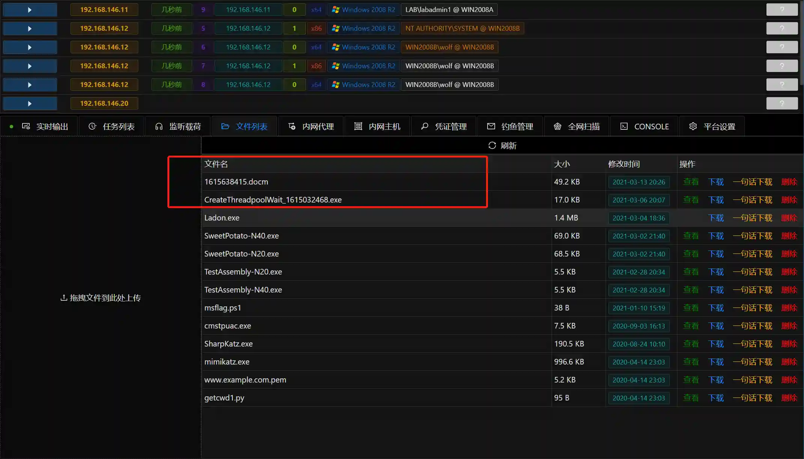

# Office macro phishing documents

# Main functions

Generate phishing documents

# How to operate

+ First add the listening configuration
+ Run the module, select the corresponding monitor

> It is recommended to choose real monitor
>

+ The file list will generate the corresponding phishing document

+ After the user opens the document and enables macros, he will be online

