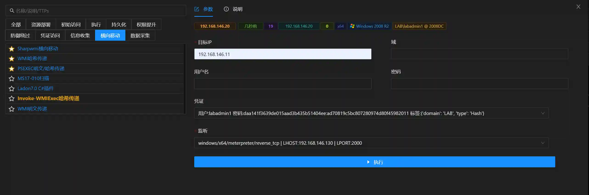
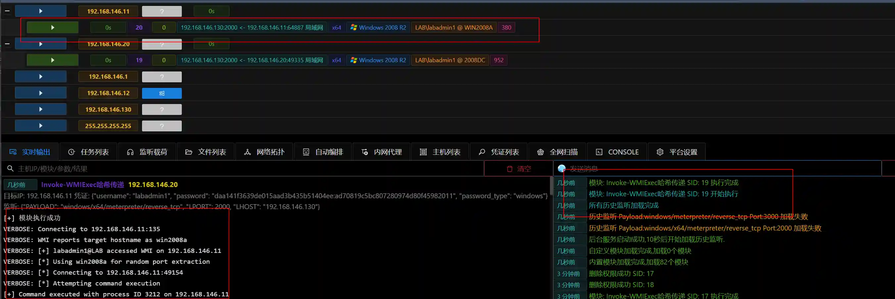

# Invoke-WMIExec Pass-the-Hash

Use known username and NTLM hash to execute payload on target host via WMI.

The module executes WMI in memory using the Invoke-WMIExec method. Compared to "WMI Pass-the-Hash", it does not require file upload.

## Operation Method

