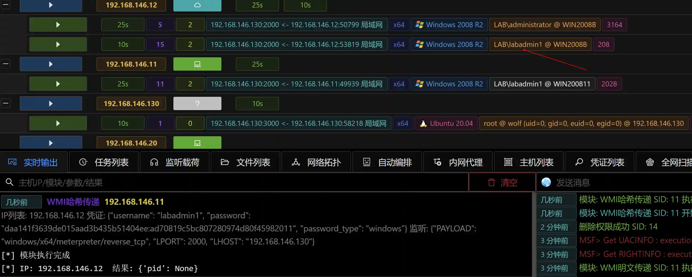

# WMI hash delivery

# Main functions

Use the Session Token or a known username and password to execute the payload on the target host through WMI.

The module uploads dswmiexec.exe to the current host and calls the powershell.exe of the other host through dswmiexec.exe. AV active defense may prompt risks.

(If the module prompts that the powershell command is too long, please use the stager type to listen) (The module does not require intranet routing)

# How to operate

# 

