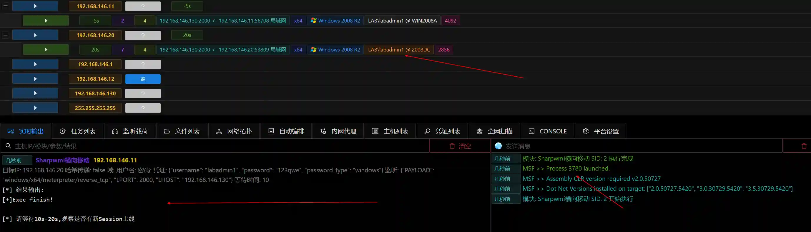

# Sharpwmi Lateral Movement

The module executes a customized Sharpwmi.exe in memory.

It conducts lateral movement by using the specified username and password or the hash in the memory of the current user. It loads the payload and connects by invoking PowerShell on the target host.

Compared with the `WMI Plaintext Transmission` module, this module does not call the local wmi.exe file.

## Operation Method
+ Passing Hashes in Memory

+ Manually Entering Username and Password

+ Using Captured Username and Password

+ Execution Results

