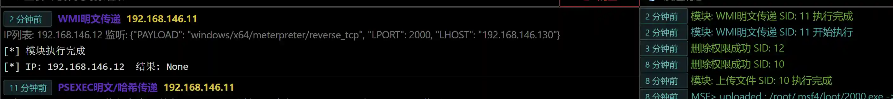

# WMI plaintext delivery

# Main functions

Use the Session Token or a known username and password to execute the payload on the target host through WMI.

The module will call the host's wmic.exe and the opponent's powershell.exe, and AV's active defense will prompt risks.

(If the module prompts that the powershell command is too long, please use the stager type to listen)

(The module does not require intranet routing)

# How to operate

If the voucher information is not filled in, the module will call the current Session token by default for remote authentication

WMI is slow to go online, so you need to wait 20 seconds to confirm whether the session is online.

