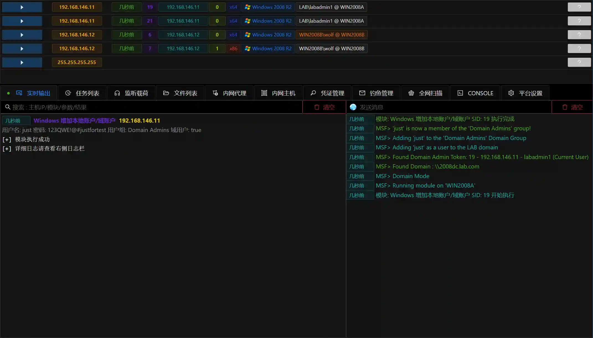

# Add local/domain account to Windows

# Main functions

Adding users to your local computer or domain via Windows API

# Things to note

When filling in a user group, you need to note that the Session must have operation permissions for the user group. When adding domain users, you need to note that the user to
which the Session belongs must be in the domain and has operation permissions for the corresponding user group.

# How to operate

+ Get Session
+ Fill in the parameters

+ Run the module

