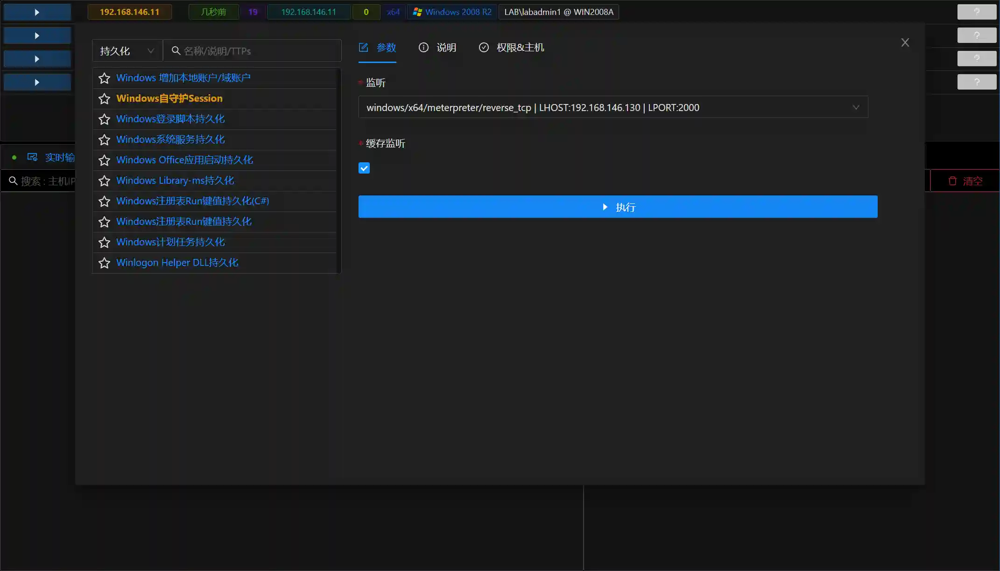
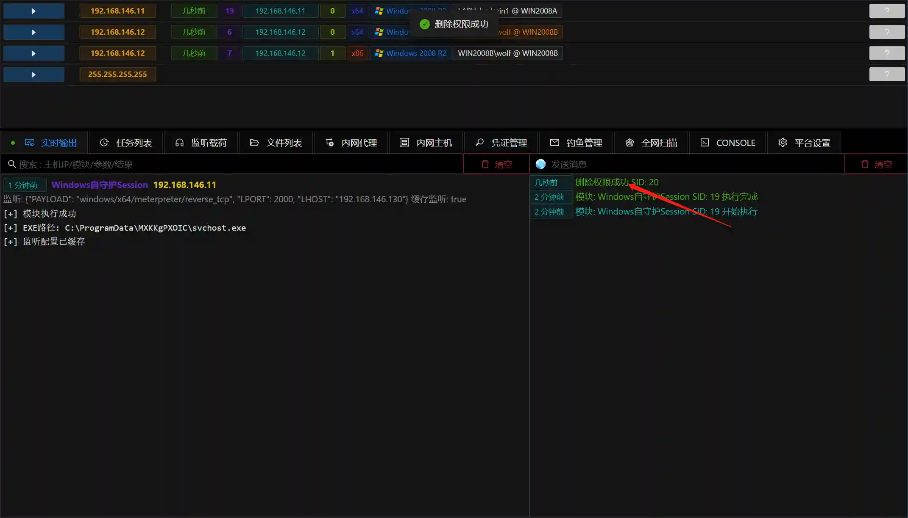

# Windows Self-Guardian Session

# Main functions

The module uploads a loader with the function of guarding itself to the specified directory of the host (C:\ProgramData\XXX).

The currently generated Session process will automatically restart after 10 seconds when it crashes or exits.

It is mainly used to generate alternate sessions to prevent the loss of initial permissions.

It is recommended to run this module immediately after obtaining the first session to ensure that permissions are not lost.

# How to operate

+ Add listening
+ Get Sesison
+ Fill in the parameters

+ Run the module

+ Session 20 is a new session, if the session is closed due to accident (using`删除权限`Simulate), the Session will be reconnected after 10 seconds

