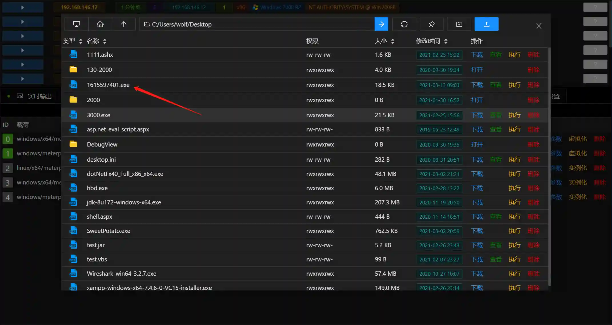

# Windows Registry Run Key Value Persistence (C#)

# Main functions

Write the load directory to the Run key value of the registry by executing SharpHide in memory

# How to operate

+ Generate listening
+ Get Session
+ Use the listening configuration to generate free kill payloads

+ Upload the generated load to the target

+ Fill in module parameters

Fill in the uploaded load-free load path

+ Run the module

