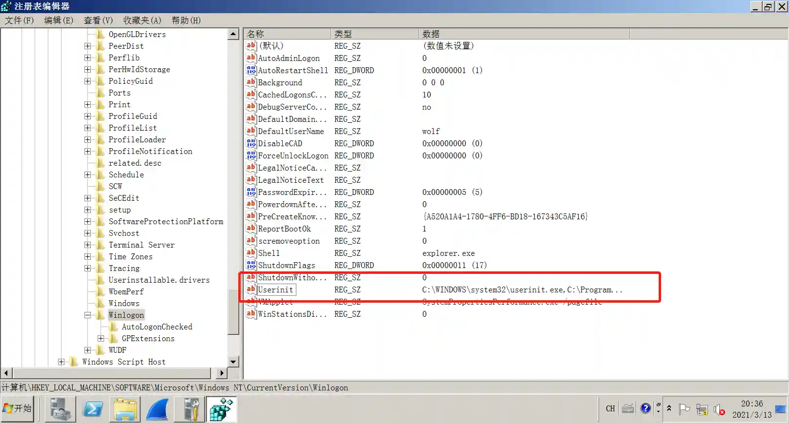

# Winlogon Helper DLL persistence

# Main functions

Persistence via HKLM\Software\Microsoft\Windows NT\CurrentVersion\Winlogon

# Things to note

It's inevitable to kill, requires administrator permission

# How to operate

+ Generate listening
+ Sesison to obtain administrator permissions
+ Run the module, fill in the monitoring configuration

+ Cache listening means that after the module is successfully run, a virtual listening will be automatically generated based on the filled-in listening parameters, which will
  facilitate recovery when the server restarts.
+ Module execution results

+ After the target machine is restarted, any userinit.exe will be executed and the Session will be regenerated.

