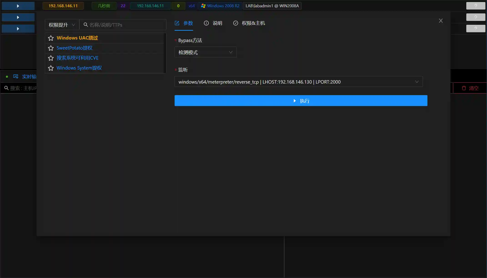

# Windows UAC Bypass

# Main Functions
Built-in with multiple methods to bypass the system UAC and obtain administrator privileges.

+ Automatic Mode: Automatically select the bypass technique and execute.
+ Manual Mode: Manually select a certain bypass technique and execute.
+ Detection Mode: Automatically detect which bypass techniques are applicable to the Session (without execution)

# Note
+ The module requires the Session integrity privilege to be at medium or above and be in the administrator group.
+ The automatic mode will run multiple sub-modules to attempt to BypassUAC, and anti-virus software may intercept.
+ It is recommended to use the detection mode to obtain the list of applicable sub-modules, and then run them manually one by one.

# Operating Methods
+ Obtain the Session.
+ View the Session information to confirm that **the Session integrity privilege is at medium or above**, **it is in the administrator group, and the UAC level is the default**.

+ Run the detection mode to view which modules are available.

+ According to the detection results, run the sub-modules separately, or use the automatic mode.

