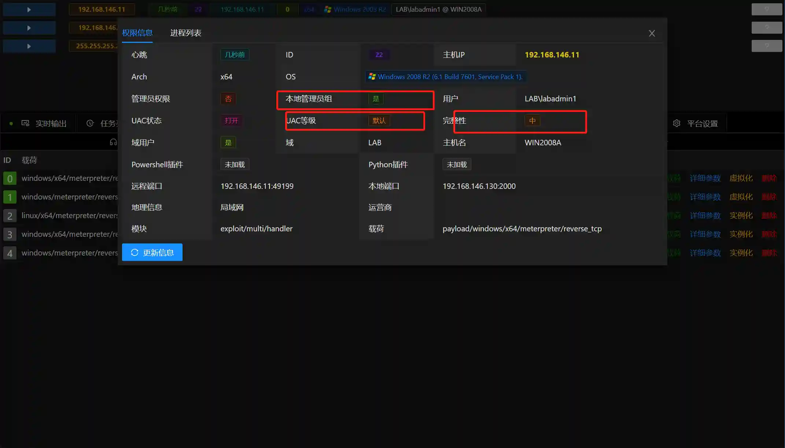
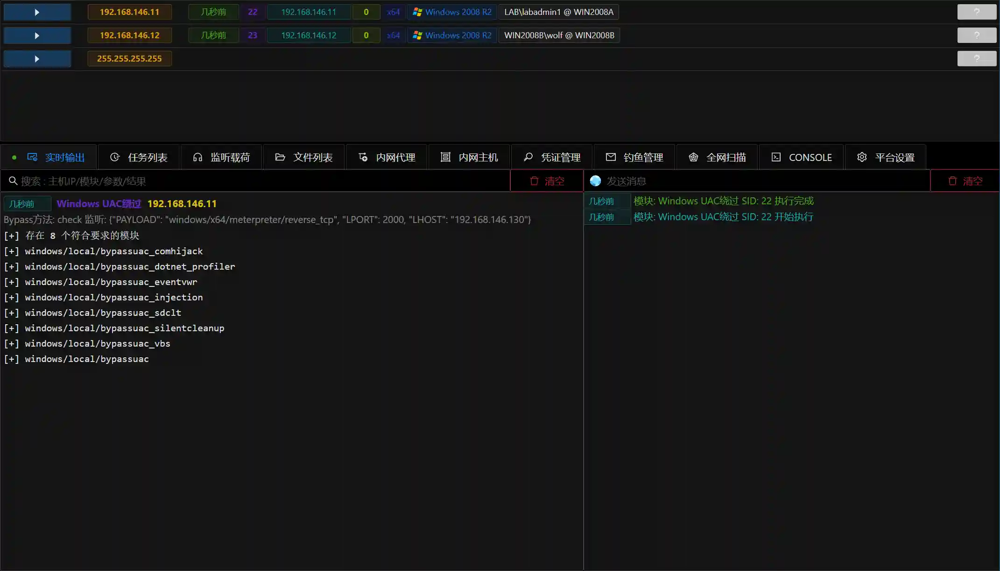

# Windows UAC Bypass

# Main functions

There are many built-in ways to bypass the system UAC to obtain administrator permissions.

+ Automatic mode: Automatically select bypass technology and execute
+ Manual mode: manually select a bypass technique and execute it
+ Detection mode: Automatically detect what bypass technology is applicable to Sesion (not executed)

# Things to note

+ The module requires Session integrity permissions above and is in the Administrator group.
+ Automatic mode will run multiple submodules to try BypassUAC, and the software will intercept it.
+ It is recommended to use detection mode to obtain the applicable submodule list and run it manually in turn.

# How to operate

+ Get Session
+ Check Session information and confirm that **Session integrity permission is above ****, **** is in the administrator group, and the UAC level is the default **

+ Run detection mode to view which modules are available

+ Run submodules separately according to the detection results, or use automatic mode

