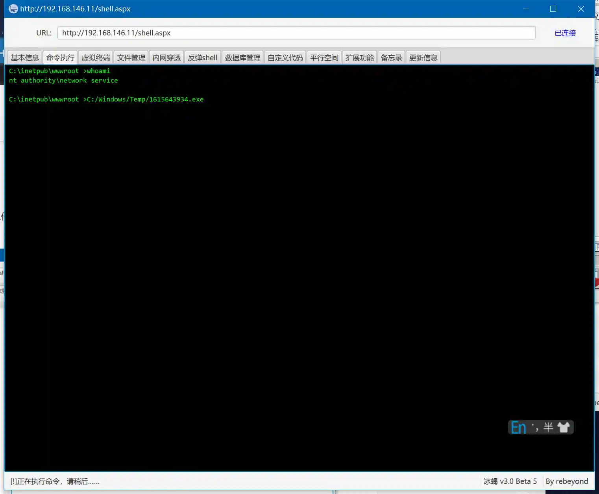
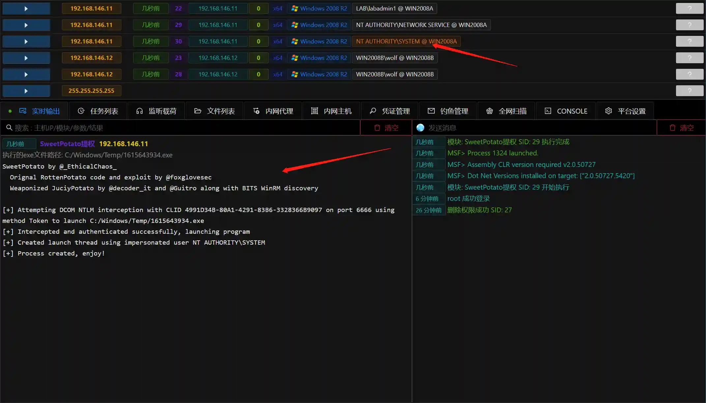

# SweetPotato escalation

# Main functions

The module uses SweetPotato.exe to escalate rights.

SweetPotato requires local service permissions, such as IIS's Network Service

# Things to note

Some IIS servers are started using ApplicationPoolIdentity user, which is a virtual user and cannot raise the authority.

The specific phenomenon is that using webshell can execute commands, but cannot execute external exe.

# How to operate

+ Take IIS as an example of
+ Added listening and generated load
+ Use webshell to upload the payload to the target and execute

+ At this time, a session with Network Service permissions is obtained

+ Use the generated Session running module, and the parameters still fill in the load uploaded before the run.

+ Run the module and get the SYSTEM permission Session

