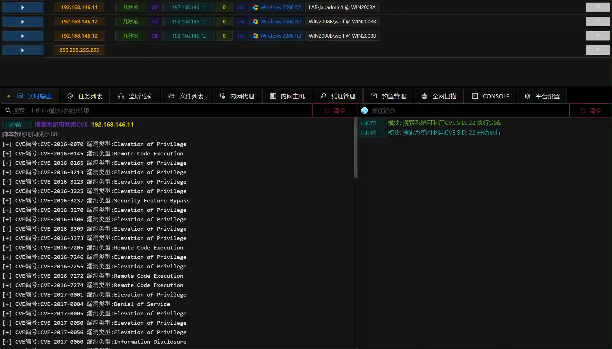

# Search system can use CVE

# Main functions

Execute powershell scripts through memory to view system version information and patch information,

Compared with the data in the database, the selection system may be affected by those CVE vulnerabilities.

# Things to note

The module may output a large amount of CVE information, it is recommended to be used as a reference only

# How to operate

+ Get Session
+ Fill in parameters and execute module

