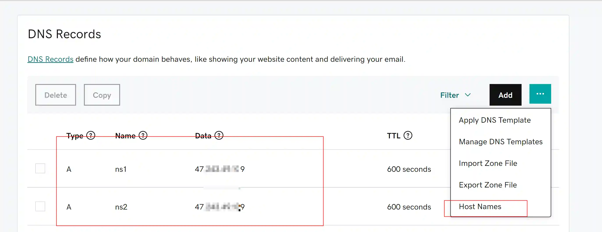
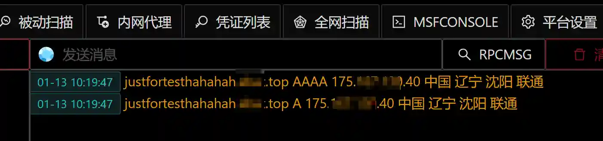

# DNSLOG Services

# Main functions

Provide DNSLog services

# How to operate

### Configure DNS

+ Buy a domain name
+ Custom DNS Host

> Alibaba Cloud
>


> godaddy
>





### Run the module


### Test configuration

+ Custom DNS servers usually need to take effect 24 hours a day, but we can use the nslookup command to determine whether the configuration is correct immediately.
+ Execute the following command on the local PC

```plain
nslookup justfortest.XXX.top 47.111.111.109
```

+ VIPER output



### Execution effect


