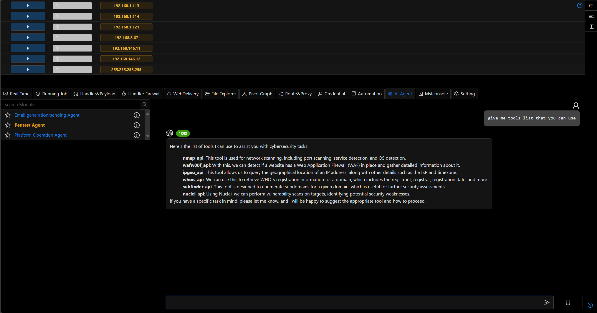
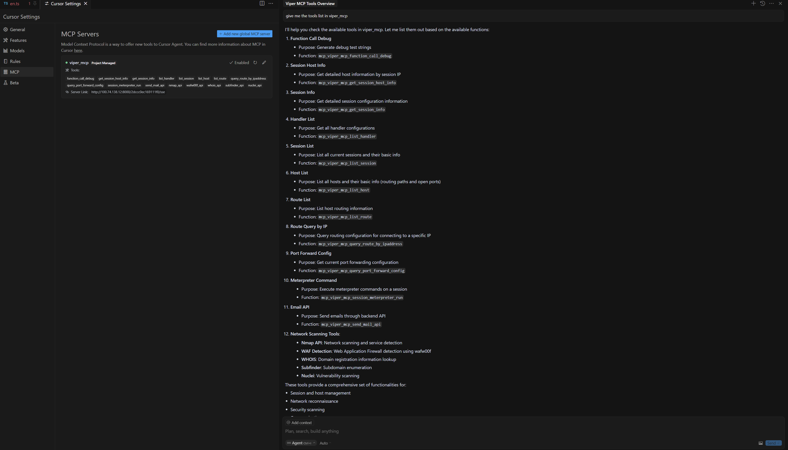
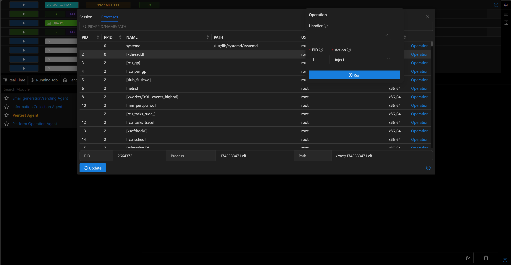
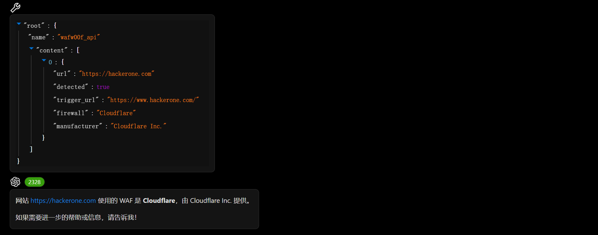
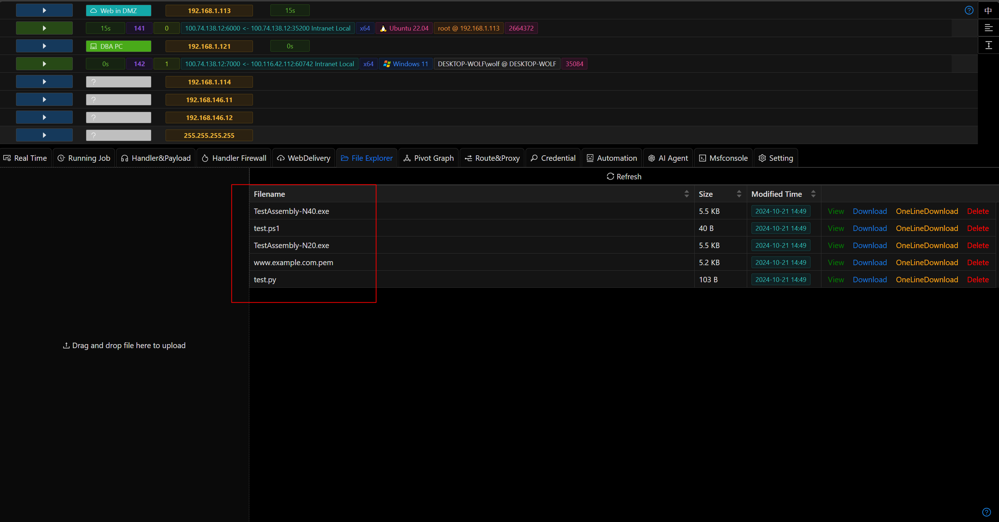
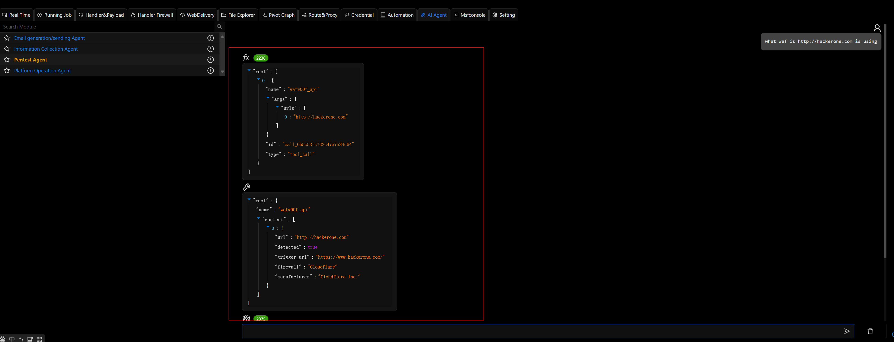
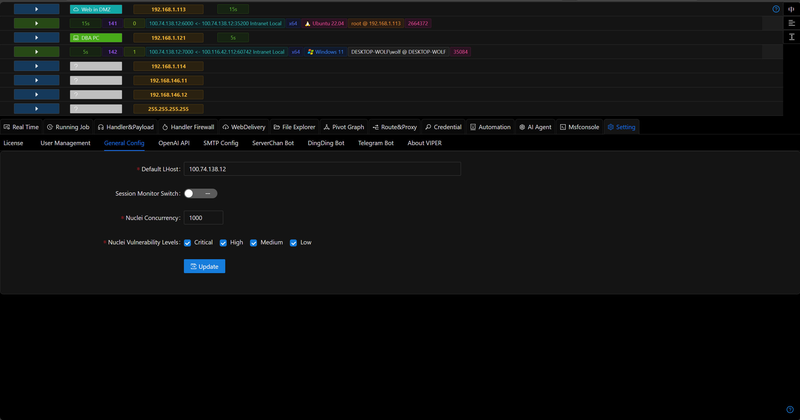
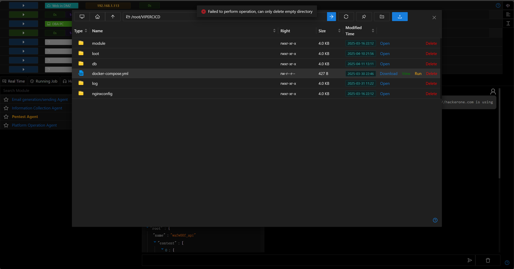

# 3.1.2 - Pentest Agent and MCP Server

## Introduction

As the industry's first red team platform to integrate LLM agents, the new version adds two LLM Agent-related features: Penetration Testing Agent and MCP Server.

More LLM and Agent capabilities will be added to Viper in subsequent updates.

> Why can't the Agent help me write all these documents yet!!!

## Pentest Agent

Due to current limitations in LLM and engineering, a fully automated Agent is not ideal.

However, it is entirely feasible for an Agent to help penetration testing engineers input complex tool parameters, analyze tool results, and provide next-step penetration plans.

[Pentest Agent Documentation](./../module/AI_Agent_Session_LangGraph_Pentest.md)

| Feature             | pentestgpt.ai               | viper pentest agent       |
|---------------------|-----------------------------|---------------------------|
| Runtime Environment | Cloud Sandbox               | Local Environment ✅       |
| Tool Runtime        | Limited to 5 minutes        | Unlimited ✅               |
| Usage Frequency     | Free version: 2/day         | Free version: Unlimited ✅ |
| Available Tools     | Free version: Limited tools | Free version: All tools ✅ |
| Model Selection     | GPT-4 only                  | Any model supported ✅     |

## MCP Server

If there's anything hottest in the current generative AI field, it would be MCP.

The new version of Viper includes an independently running MCP server. Please refer to the documentation for usage instructions and the list of supported tools.

[MCP Server Documentation](./../guide/mcpserver.md)

## Bug Fixes

- Fixed issues with Session file upload/download/process operations

- Default certificates and test Python/PowerShell scripts are now available

- Fixed an issue where the agent module returned an exception [issus](https://github.com/FunnyWolf/Viper/issues/238)

## Optimizations

- Host tags and notes are now integrated

- Agent tool invocation and tool results are displayed in JSON format

- Nuclei default configuration UI

- `Generate PE/ELF` has been modified to native exe and elf payloads, with source code compiled versions available via module generation
- Linux now checks if a folder is empty before deletion

- Optimized some UI interfaces and cleaned up deprecated frontend components.