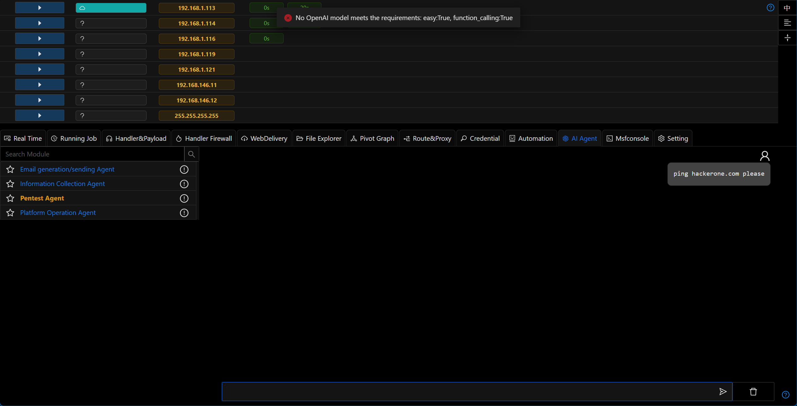
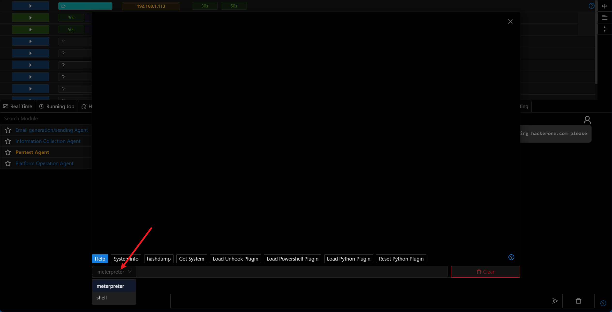
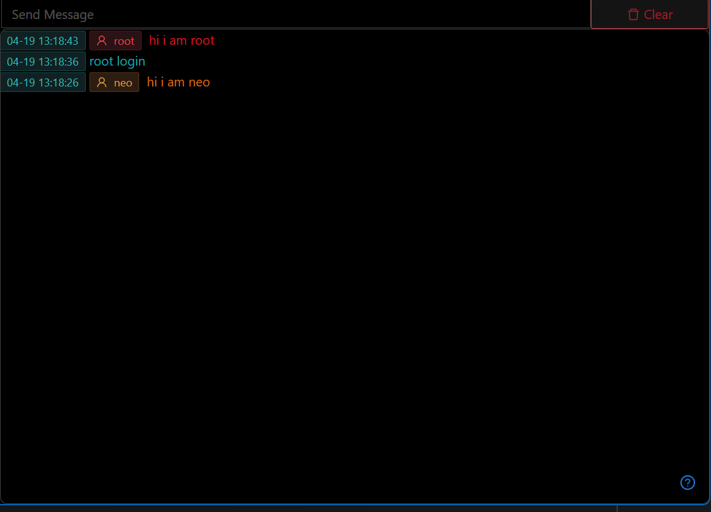

# 3.1.3 - It's Not a Bug, It's a Feature !

This version mainly focuses on documentation updates and ~~bug fixes~~ feature optimizations 😅.

Of course, we managed to sneak in a couple of new features during our breaks.

Oh, and we tweaked the AI functionality a bit too.

## New Telegram Bot

We've redesigned the Telegram Bot functionality in this version. Users no longer need to create their own bot - just open the official Viperrtp bot and send your chat_id to receive messages.

[Telegram Bot Documentation](../guide/telegram_bot.md)

[Create a Free Telegram Bot in Ten Minutes](../training/create_free_telegram_bot_in_ten_minutes.md)

## One-Click Deployment of nmap/python3.12/socat to Internal Hosts

Added the new `Deploy Kit Suite to Target Host` module for quickly deploying common tools and Python environment on compromised Linux hosts in internal networks.

[Deploy Kit Suite to Target Host Documentation](../module/Execution_CommandAndScriptingInterpreter_DeployKit.md)

One-click deployment of Nmap+Python3 to create a dual-channel for internal network reconnaissance and penetration.

## Optimizations

- Tons of UI/UX improvements (22 git commits)

> Optimizing pages is addictive, CSS is truly anti-programmer

- Massive documentation updates (all docs in the `Guide` section)

> I hate two types of people: those who develop tools without documentation, and those who make me write documentation for tools

- Updated `auto-install` script with options to generate random SSL certificates, customize ports, and add Basic authentication for anti-tracing during installation

> Mom no longer worries about my IP getting blocked

- Session options only show when `Transport` functionality is supported
- When adding OpenAI config, backend checks function calling support if that option is selected
- `Penetest Agent` and `MCP Server` now support local terminal calls

> Might not be super useful now, but it will be when we integrate more red team CLI tools. We're working on it, really! (Progress: 0%)

- Error messages now show in the UI when no suitable large model config is found during agent execution

- Added Meterpreter/Shell switching in Session Console

- Different colors for user messages

- Updated `Pivotgraph` component for better distinction between network communication and Session binding logic

- Improved `PortFwd` Tip

## Bug Fixes

- Fixed unnecessary port occupancy check during reverse port forwarding
- Fixed missing Readme links for running tasks in `Task List`