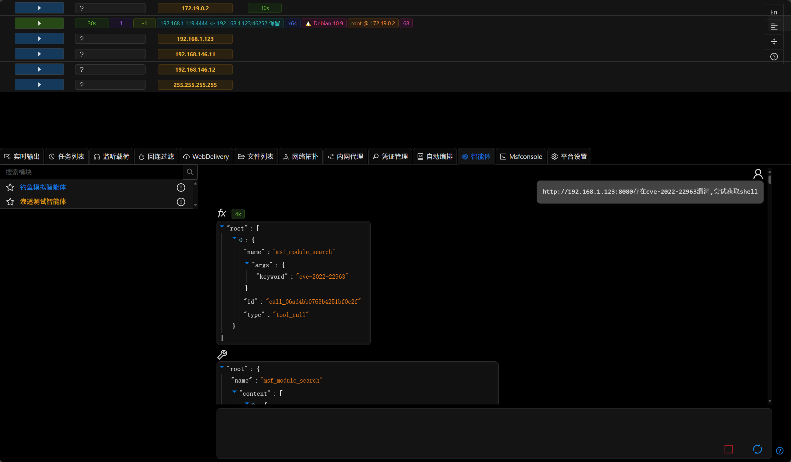

# 3.1.4 - Happy International Workers' Day

## Penetration Testing Agent

- The agent now supports MSF-related functionality
- The agent can currently perform automated penetration testing by calling multiple built-in tools

> The current automation capabilities of the agent are in the proof-of-concept stage

## AI Agent

- Added interrupt function, users can manually interrupt the agent's operation from the interface

> The new agent performs multiple rounds of automated tool calls during penetration testing, so the interrupt function is essential

- Optimized UI interaction and performance

## MCP Service Supports MSF-Related Functions

- MSF-related functions have also been added to the MCP server

## Documentation Improvements

All documentation text on the official website has been updated, with module/tutorial images to be updated in the new version.

The titles and descriptions of platform modules have all been updated.

> The historical documentation burden has been resolved, finally making it enjoyable to write code.

## Optimizations

- Numerous UI/UX improvements
- Updated the built-in CVE database for "Search Exploitable CVEs"
- Internal network scanning modules now store corresponding host information in "Host Information"

- Updated metasploit-framework to the latest version (6.4.61)
- Improved automated installation script, user input errors no longer interrupt installation

## Bug Fixes

- Fixed issue where source code generated by the anti-detection module occasionally couldn't compile
- Fixed backend callback issue when MSF modules end quickly
- Fixed "WMI Hash Pass-through" module refusing to run
- Fixed timeout issue in "Get Windows Browser Passwords (C#)"
- Fixed issue with incorrect CIDR handling in modules
- Fixed issue where x64 type payloads couldn't be used with "Office Macro Phishing Document"
- Fixed issues with multiple persistence-related modules unable to use x64 type payloads