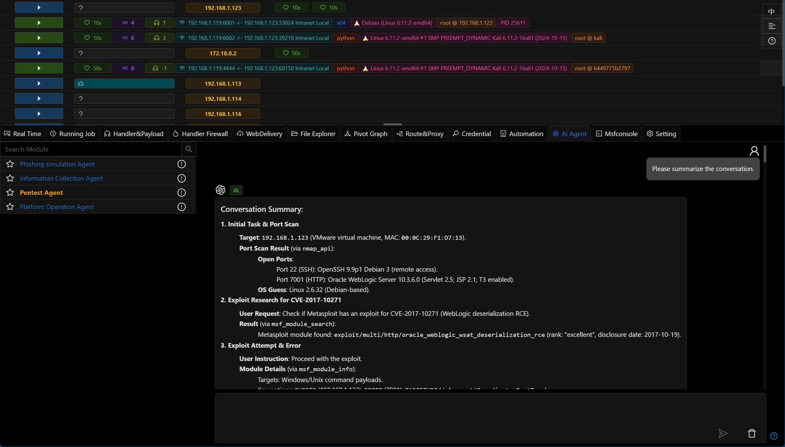

# 3.1.5 - GitHub Issues Week

Penetration testing agent optimized prompts and added summary functionality, added Bark message push feature, refactored anti-detection modules, adjusted license functionality to avoid impact due to network issues or outdated licenses, and numerous UI/UX improvements

## Penetration Testing Agent

- For multi-round conversations (exceeding 10 messages), automatic summarization will occur to reduce token usage

- Updated agent prompts
- The agent now switches output language based on the frontend interface language

## Bark Message Push

- Added Bark message push functionality for receiving platform notifications

[Bark Bot Documentation](../guide/bark_bot.md)

## Anti-Detection Modules

- Anti-detection options previously in the `Payload` generation have been separated into independent modules
- [Linux Basic Shellcode Loader](../module/Execution_UserExecution_LinuxBaseShellcodeLoader.md)
- [Custom Linux Shellcode Loader](../module/Execution_UserExecution_LinuxLoaderDIY.md)
- [Custom Windows Shellcode Loader](../module/Execution_UserExecution_LoaderDIY.md)
- [Windows Basic Shellcode Loader](../module/Execution_UserExecution_ExeSrc.md)
- [MSBuild Shellcode Execution](../module/Execution_UserExecution_MSBuild.md)

## License Functionality Adjustments

- Optimized handling logic for situations where license server cannot be connected due to network fluctuations (or GFW)
- After license expiration, it will automatically extend for 7 days with reminders, making it convenient for users to add new licenses

## Improvements

- UI/UX optimizations
- Support for mouse drag to adjust upper and lower space sizes
- Automatically add `handler name` when creating new handlers
- Display mac icon for osx type sessions
- Support for osx type payloads
- `File Explorer` supports direct editing of text files
- Added [GodPotato Privilege Escalation](../module/PrivilegeEscalation_ExploitationForPrivilegeEscalation_GodPotato.md) module
- Updated metasploit-framework to the latest version (6.4.65)

## Developer's Notes

Viper released version 3.1.5, with many update inspirations coming from Github issues, so this release is called Github Issues Week!

AI-related updates always come first in each release. The penetration testing agent has been updated in two ways: 1. Updated prompts, with the framework referencing Cursor Agent's prompt structure for optimization.

When using the agent, each task involves many rounds of conversation. The new version adds automatic summary nodes - when conversations exceed 10 rounds, it summarizes historical information, greatly saving token usage for complex tasks.

In the new version, the agent's prompts switch according to the user interface language, providing a better experience for users of different languages (in previous versions, the agent language depended on system prompts).

Added Bark notification functionality. Previously, development was delayed due to not having an iPhone, so thanks to my wife for kindly providing an iPad to make this feature possible.

When reviewing Viper's payload-related code, I found many functions coupled together (programmers indeed criticize their past selves), so I separated many anti-detection features from the framework layer into independent modules for easier user selection and use.

Viper's license uses Cloudflare's CDN, which sometimes can't connect due to GFW (not sure why it wasn't a problem before), so the new version only fails verification after many consecutive failed connections to the server.

With the above license logic update, if a license is activated and used in an offline environment, it can be used continuously for 24 hours, requiring online activation every 24 hours.

Viper uses creem's license service. I originally thought the license validity period would automatically extend based on subscription time, but it doesn't - users need to manually activate a new License each month (which is frustrating).

So in the new version, if a license expires, it will only provide reminders within 7 days without affecting usage, allowing users to add a new license within that period.

The best solution would be to bind the license to the subscription period, but creem's API cannot obtain subscription information through the license, nor license information through the subscription, so this is the only way to handle it.

Creem's API has too few features, with many functions requiring developer implementation. However, the advantage is that as a new platform, it offers significant benefits to independent developers and provides the best support for Chinese independent developers (though the API still needs updating - currently it's barely usable).

Thanks to Cursor, the long-desired drag-to-adjust space functionality has finally been implemented.

When implementing this feature with Cursor, I truly used vibe coding, as I could only describe the requirements but couldn't provide specific technical implementation details (frontend is not my strength).

Previously, I mainly used Tab with Cursor, implementing the framework myself. In my experience, if you're unfamiliar with a development language or implementation method, it's best to research via Google or GPT first, then ask Cursor. Otherwise, you waste time and quickly use up Cursor's limited quota.

Viper uses the current timestamp to name generated payloads, making it impossible to distinguish between multiple payloads. So the new version automatically generates an alias based on listener configuration (when users don't input an alias), and payloads generated with this listener will also use this alias for naming.

I previously thought osx sessions were used too infrequently in actual operations, but after repeated urging from an unnamed friend, osx type sessions now have their own dedicated icon in the new version (previously using the linux icon).

Since this is called Github Issues Week, clearing issues is the top priority. The need to directly modify files in the `File Explorer` has existed in issues for a long time. In the new version, this has been implemented - in some scenarios, text files can be modified and directly uploaded to the session.

GodPotato was also requested in issues and has now been added (haven't set up IIS for testing, but I think it should work fine).

Finally, as usual, the metasploit-framework has been updated to the latest version.
