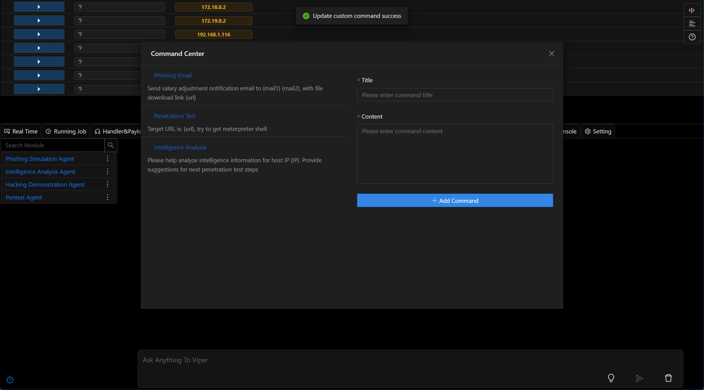

# 3.1.7 - Python Is All You Need

## Multiple Kit Suite Modules

- Added `Deploy Kit Suite to Windows Host` module, for detailed information refer
  to [Deploy Kit Suite to Windows Host](../module/Execution_CommandAndScriptingInterpreter_DeployKitWindows.md)
- Updated `Deploy Kit Suite to Linux Host` module, for detailed information refer
  to [Deploy Kit Suite to Linux Host](../module/Execution_CommandAndScriptingInterpreter_DeployKit.md)
- Added `Windows Host Information Collection (Kit)` module, for detailed information refer
  to [Windows Host Information Collection (Kit)](../module/Discovery_Multi_LocalWindowsInfoCollect.md)
- Added `Internal Network Port Scanning (Kit)` module, for detailed information refer
  to [Internal Network Port Scanning (Kit)](../module/Discovery_NetworkServiceScanning_PortScanByPythonKit.md)
- Added `Internal Network Port Scanning and Service Recognition (Kit)` module, for detailed information refer
  to [Internal Network Port Scanning and Service Recognition (Kit)](../module/Discovery_NetworkServiceScanning_PortScanWithServiceByPythonKit.md)
- Added `Execute Python Script (Kit)` module, for detailed information refer
  to [Execute Python Script (Kit)](../module/Execution_CommandAndScriptingInterpreter_RunPythonScriptByKit.md)

## Intelligence Analysis Agent

- Updated agent prompts
- Intelligence information collected by `Deploy Kit Suite to Windows Host` can be analyzed by the agent to provide next-step action plans

## Phishing Simulation Agent

- Updated agent prompts to better align with real-world phishing simulations targeting specific company employees
- Now supports sending emails to multiple addresses at once

## Agent Command Center

- Added `Command Center` feature, allowing users to quickly input preset instructions (prompts) or custom instructions (prompts) and send them to agents for execution

## Optimizations

- UI/UX improvements
- Updated metasploit-framework to the latest version (6.4.70)

## Bug Fixes

- Fixed `Session Monitor` notification issue [issues 249](https://github.com/FunnyWolf/Viper/issues/249)

## Developer Notes

The major update in this version is the support for deploying Kit Suite on Windows, enabling Python usage on Windows hosts. The implementation involves packaging a prepared Python
interpreter using 7zip into a Kit Suite, which can then be extracted and used on Windows hosts.

Compared to the previous method of executing Python scripts in memory, this approach allows the use of more Python libraries such as requests, wmi, etc., with the potential to add
even more Python libraries in the future. It also offers high stability, and running scripts won't affect the Session.

If Python scripts don't involve sensitive information like Shellcode, they generally won't trigger antivirus software even when saved to disk.

The current Viper version now supports Python environment deployment on both Windows and Linux, so existing port scanning scripts have been optimized and related modules have been
added to utilize the Python environment in the Kit Suite.

`Windows Host Information Collection (Kit)` is a pure Python implementation for local information gathering module that can collect basic information from Windows hosts in one go,
including system information, process list, network connections, desktop file list, installed software list, etc. The collected information can be analyzed by agents to provide
next-step action plans.

Additionally, the `Execute Python Script (Kit)` module has been added to facilitate users in executing custom scripts using the Python environment in the Kit Suite.

The `Intelligence Analysis Agent` mainly adapted prompts for information collected by `Windows Host Information Collection (Kit)`, adding more targeted instructions to help the
agent better analyze intelligence information and provide next-step action plans.

To make the `Phishing Simulation Agent` more practical, company-related prompts were added to the instructions, and the email sending API now includes the ability to send to
multiple email addresses at once, avoiding multiple Tools calls by the agent.

The `Command Center` feature is new, allowing users to quickly input preset instructions (prompts) or custom instructions (prompts) and send them to agents for execution. This
feature can improve user work efficiency and reduce repetitive operations.

Finally, there are regular UI/UX optimizations and bug fixes, as well as an update to the latest version of metasploit-framework.
