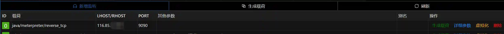

# Behinder and Viper linkage

> Testing based[**Behinder_v3.0 Beta 7**](https://github.com/rebeyond/Behinder/releases/tag/Behinder_v3.0_Beta_7)Version

## The target host does not go out of the network and launches the meterpreter version of Java

> 116.85.xx.xx is the VPS address of Viper

+ Behinder has obtained the target webshell normally and can execute commands normally
+ Create corresponding listening in Viper

+ Switch to`反弹shell`Configure as follows

+ After execution, you can get the meterpreter version of java

> Principle of online
> 
> Behinder will establish a listening position on the target host port 9090, and map the port to 9090 of 116.85.xx.xx through the Behinder client network (that is, your PC).

## The target host does not go out of the network and launches the native version of meterpreter

> The Java version of meterpreter lacks many functions, and the native version of meterpreter is more powerful

+ Behinder has obtained the target webshell normally and can execute commands normally
+ Switch to`内网穿透`Configure as follows

+ Viper establishes monitoring according to the following configuration

+ Viper generates loads according to the following configuration, please read the instructions below carefully

> LHOST Fill in the intranet IP address of the controlled host, or fill in 127.0.0.1
>
> LPORT is consistent with Viper monitoring and Behinder configuration
>
> The RC4 password must be consistent with the monitoring configuration
>

+ Upload the generated payload (exe) through Beninder and execute it

> Principle of online
>
> Behinder will establish a listening position on the target host port 2222, and map the port to 2222 of 116.85.xx.xx through the Behinder client network (that is, your PC).
>
> Viper generates a payload to connect to the target host's local 2222 port 222 to the VPS116.85.xx.xx
