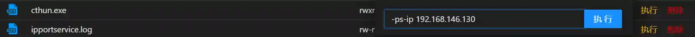
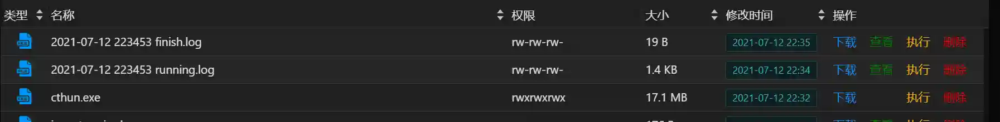

# cthun3 and Viper link

cthun3 is a tool for integrated port scanning, service recognition, netbios scanning, website recognition, brute force cracking and vulnerability scanning.


# screenshot
> Screenshots when using cthun3 in combination with viper
>






# How to use
## Port Scan
### -ps-ip
The IP address range of port scan, for example, you can enter

```plain
-ps-ip 192.168.146.1-255,192.168.147.1-192.168.148.255,192.168.149.1/24,ip.txt
```

ip.txt and cthun are in the same directory. The content of ip.txt can be in the following format

```plain
192.168.146.1-255
192.168.147.1-192.168.148.255,192.168.149.1/24
```

### 
### -ps-p
Port scan port range, for example, you can enter

```plain
-ps-p 22,80,1-65535
```

### 
### -ps-tp
Port scan top N port, for example, you can enter

```plain
-ps-tp 100
```

### 
### -ps-r
The number of retry times of port scanning for each port can enhance stability

```plain
-ps-r 2
```


**You can use it as follows**

```plain
cthun -ps-ip 192.168.146.1-255,ip.txt -ps-p 60000 -ps-tp 100 
```


## Netbios Scan
### -ns-ip
The IP address range of port scan, for example, you can enter

```plain
-ns-ip 192.168.146.1-255,192.168.147.1-192.168.148.255,192.168.149.1/24,ip.txt
```

ip.txt and cthun are in the same directory. The content of ip.txt can be in the following format

```plain
192.168.146.1-255
192.168.147.1-192.168.148.255,192.168.149.1/24
```


## Http Scan
### -hs-ipport
Used in combination with portscan, http scan will automatically add the ip:port of the http and https protocols in the portscan result to the scan queue, just enter

```plain
-hs-ipport ps
```

http scan can also specify the ip:port list separately, for example, you can enter

```plain
-hs-ipport 192.168.146.1/24:8009,192.168.146.1-255:80,ipport.txt
```

ipport.txt and cthun are in the same directory. The ip.txt content can be in the following format

```plain
192.168.146.1-255:80
192.168.147.1-192.168.148.255:443,192.168.149.1/24:8080
```

### 
### -hs-url
Check if the website has a specified URL

```plain
-hs-url /admin/login.jsp,/js/ijustcheck.js,/shell.php
```

**You can use it as follows**

```plain
cthun -ps-ip ip.txt -ps-tp 100 -hs-ipport ps -hs-url /admin/login.jsp

cthun -hs-ipport 192.168.146.1-255:80 -hs-url /admin/login.jsp
```


## Brute force cracking
### -bf
Used in combination with portscan, brute force cracking will automatically add the ip:port of the protocol that meets the conditions in the portscan result to the cracking queue, just enter


```plain
-bf
```

List of brute force cracking protocols: **smb, ssh, redis, ftp, rdp, mysql, mongodb, memcached, vnc**


### -bf-smb
Smb protocol brute-force cracking, support and user:pass and hashs brute-force cracking

Used in combination with portscan, automatically add the ip:port of the smb protocol in the portscan result to the scan queue, just enter

```plain
-bf-smb ps
```

http scan can also specify the ip:port list separately, for example, you can enter

```plain
-bf-smb 192.168.146.1/24:445,192.168.146.1-255:445,ipport.txt
```

### 
### --bf-ssh -bf-redis -bf-ftp -bf-rdp -bf-mysql -bf-mongodb -bf-memcached -bf-vnc
Reference -bf-smb usage method


### -bf-u
Brute-force user name dictionary,

```plain
-bf-u  lab\\administrator,administrator,root,user.txt
```

user.txt file content format

```plain
root
test
funnywolf
```


### -bf-p
Brute force password dictionary,

```plain
-bf-u   1234qwer!@#$,root,foobared,password.txt
```

password.txt file content format

```plain
root
test
123456
```

### 
### -bf-h
Smb brute force cracking hash dictionary (note that it does not support the command line to directly enter hash content)

```plain
-bf-h hashes.txt
```

hashes.txt file content format

```plain
sealgod,domainadmin1,ae946ec6f4ca785ba54985f61a715a72:1d4d84d758cfa9a8a39f7121cb3e51ed
sealgod,domainadmin2,be946ec6f4ca785ba54985f61a715a72:2d4d84d758cfa9a8a39f7121cb3e51ed
```


### -bf-sk
ssh protocol private key brute-force cracking, id_rsa is the private key file name, id_rsa and cthun are the same directory as id_rsa

```plain
-bf-sk id_rsa
```


### --bf-dd
Whether to use built-in dictionary for brute force

```plain
-bf-dd
```

**You can use it as follows**

```plain
cthun -ps-ip ip.txt -ps-tp 100 -bf -bf-u user.txt -bf-p password.txt

cthun -ps-ip ip.txt -ps-tp 100 -bf-smb ps -bf-u user.txt -bf-p password.txt

cthun -bf-smb 192.168.146.1-255:445 -bf-u user.txt -bf-p password.txt
```


## Vulnerability scanning
### -vs
Used in combination with portscan, the vulnerability will automatically add the ip:port of the protocol that meets the criteria in the portscan result to the crack queue, just enter


```plain
-vs
```

Vulnerability scanning protocol list: **smb, http, https**

****

### -vs-smb -vs-http
Reference -bf-smb usage method

****

****

## Network parameters
### -ms
The maximum number of connections is 100 for Windows and 300 for Linux.

```plain
-ms 200
```

****

### -st
The socket timeout time (seconds). Generally, the network delay in the intranet is very low, and it is recommended to be less than 0.3.

```plain
-st 0.2
```

****

### -lh
Whether to load the historical scan results in ipportservice.log, for`http扫描``暴力破解``漏洞扫描`wait

```plain
-lh
```


# advantage
+ Port scanning speed is fast (255 IPs, TOP100 ports, 15 seconds)
+ Port scanning speed is fast (255 IPs, TOP100 ports, 15 seconds)
+ Port scanning speed is fast (255 IPs, TOP100 ports, 15 seconds)
+ Accurate service identification (integrated NMAP fingerprint database)
+ Single file without dependencies (convenient to intranet scanning)
+ Strong adaptability (Windows Server 2012, CentOS6, Debain9, ubuntu16)
+ Support multiple protocol brute-force cracking
+ Support netbios scanning (get multiple network card IP)
+ Support vul scanning (ms17-010)


# shortcoming
+ Executable file large (20M)
+ Windows Server 2003/Windows XP is not supported


# Vulnerability List
+ ms17-010
+ CVE_2019_3396
+ CVE_2017_12149
+ S2_015
+ S2_016
+ S2_045
+ CVE_2017_12615
+ CVE_2017_10271
+ CVE_2018_2894
+ CVE_2019_2729


# rely
+ RDP's brute force cracking depends on OpenSSL (Windows Server 2003/Windows XP cannot use rdp brute force cracking, other functions have no effect)
+ Linux server needs glibc version to be greater than 2.5 (higher than centos5, ldd --version to view)


# Tested
+ Windows 7
+ Windows Server 2012
+ CentOS5
+ Kali


# Update log
****

**1.0 beta**
Update time: 2021-07-12


+ Release the first version


> cthun is an ancient god in World of Warcraft video games
>

