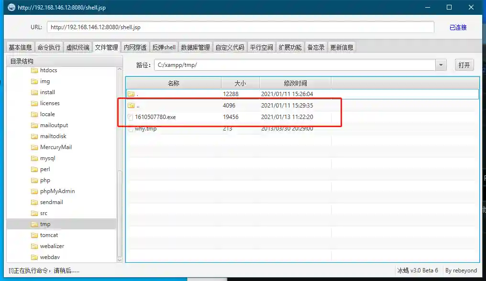

# Get permissions

## Generate listening

+ Select **Speaker payload-Add new listening**, enter the new listening page

+ Take reverse_tcp as an example

> Please note that the external network IP address filled in LHOST as VPS, Viper will automatically prompt
>
> If you use domestic vps such as JD.com, Alibaba Cloud, etc., please use reverse_https and configure the certificate to bypass traffic detection
>

## Generate load

+ Click the corresponding monitor **generate payload**, and the browser will automatically download an unkilled exe or elf

> The free kill load may fail due to the md5 tag added by the antivirus software manufacturer
>
> Viper will continue to update to fight against Killing Soft
>

## First Session

+ Upload the generated exe to the host you want to control, and then execute

> Taking the ice scorpion webshell as an example, Session is an enhanced version of the shell, and the subsequent Session is collectively called permissions
>

+ At this time the console has obtained a Session

## Host and Session

The console displays the permissions and important information about the host, and introduces the meaning of each icon from left to right.

+ Click the Execute Module button to display all available modules

> The platform will automatically filter applicable modules based on whether the current target has session permissions.
>

+ Colored rectangular labels represent session last heartbeat time

> The icon will turn red after the heartbeat time exceeds 1 minute. At this time, the VIPER background believes that the session may have expired. However, for tcp payloads, it may be in a dormant state when not operating for a long time, causing the heartbeat to exceed 1 minute. Re-operate the session to wake up.
> session
>

+ The purple label with the number is sid, used to mark the session.
+ IP rectangular tags represent the connection ports tested on the Internet,

> This IP address is generally the public IP of the enterprise's exit router
>
> At this time, when the mouse moves to the top of the tag, the session complete network connection information and GeoIP (geographic location information) will be displayed.
>

+ x64 and x86 tags indicate the arch, x64 and x86 colors of the session are different

> arch means the arch of the session process, but does not mean the arch of the operating system. The arch of the operating system can be viewed in the host information.
>

+ Rectangular label with icons to identify the session is Windows system or Linux system and system version
+ Rectangular tag displays host name, current user and other information.

> The white one indicates that the session is the ordinary user's permission, and the golden one indicates that the session is the administrator's permission (it has passed uac), which is convenient for intuitive judgment.
>

+ The yellow IP address indicates the IP of the host in the intranet

> The intranet can be understood as a network behind NAT
>

+ Square icon represents the icon label of the host. You can modify it by clicking the icon. When the mouse moves to the icon, the host's note information will be displayed.

+ Clicking on any tag in permissions will pop up all available actions for permissions

+ Click any tag in the host to operate/view/modify/update the information set with the host IP as ID

## Frequently Asked Questions

+ Why is VIPER not correctly generated on Alibaba Cloud VPS?

> Domestic cloud manufacturers such as Alibaba Cloud have traffic monitoring devices. Please use encrypted monitoring (reverse_https). Due to vps bandwidth reasons, please wait for a while after executing payload. Please do not delete the corresponding monitoring.
>

+ Why is the interface I see different from the interface in the document/the page is confused?

> The minimum resolution supports 1366x768. If the interface is confused, please try to clear the browser cache.
