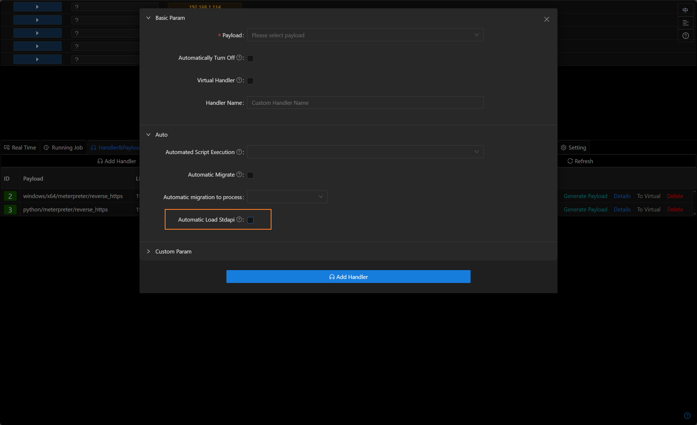
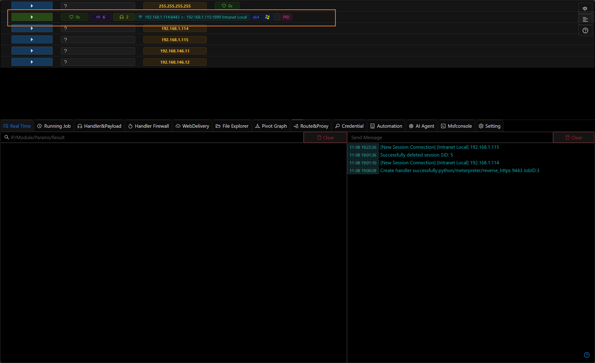
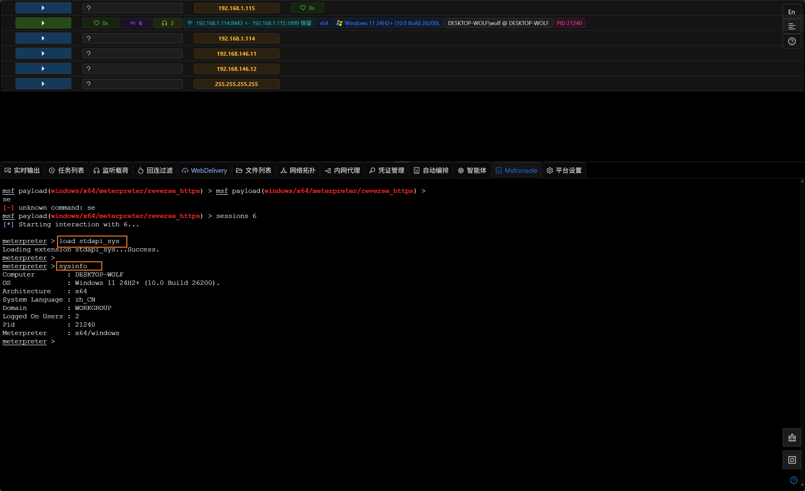

# Manually Loading the stdapi Plugin

## Introduction

Viper introduced the ability to manually load the stdapi plugin in version 3.1.9. The overall stdapi plugin has been split into multiple sub-plugins, allowing users to load only the functionality they need and thereby reduce the memory footprint.

## Steps

- When creating a listener, disable automatic loading of the stdapi plugin.

- Use that listener to generate a payload and get a session; the Meterpreter session will appear incomplete.

- Enter the Meterpreter console and use the `load` command to manually load the required stdapi sub-plugins (for example: `load stdapi_sys`, `load stdapi_ls`, `load stdapi_net`, etc.).

- After loading `stdapi_sys`, run the `sysinfo` command; Meterpreter will now display the correct system information.
