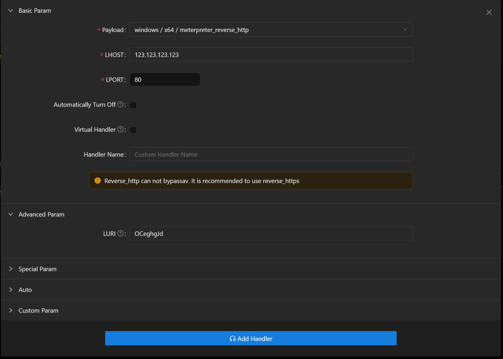

# Using CDN to Online Meterpreter

## Prerequisites

+ Purchase a domain name (recommended to use [cloudflare](https://www.cloudflare.com/))
+ [cloudflare](https://www.cloudflare.com/) account

## Configure CDN

+ Log in to cloudflare, select your domain, and click `DNS`

+ Add an A record to resolve the domain to your VPS IP address, and configure CDN acceleration

## Create a Listener

+ Create a new listener in Viper, select `meterpreter_reverse_http` (supports both Windows/Linux)

+ Fill in the VPS IP as LHOST, 80 as LPORT, and record the LURI value

## Generate Payload

+ Create a new listener in Viper, select `meterpreter_reverse_https`

+ Fill in the CDN-configured domain as LHOST, 443 as LPORT, and use the LURI value recorded in the previous step

+ Check `Virtual Listener`, create a new listener (this listener is only used to generate the payload, no actual listener needs to be established)

+ Click `Generate PE/ELF` to create the payload

+ Upload to the target host and execute

## Notes

+ Both listener and payload only support `meterpreter_reverse_http(s)` type