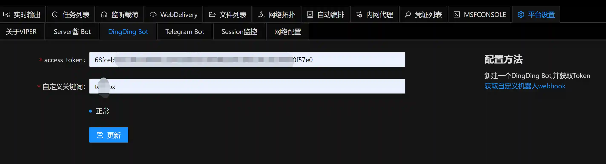
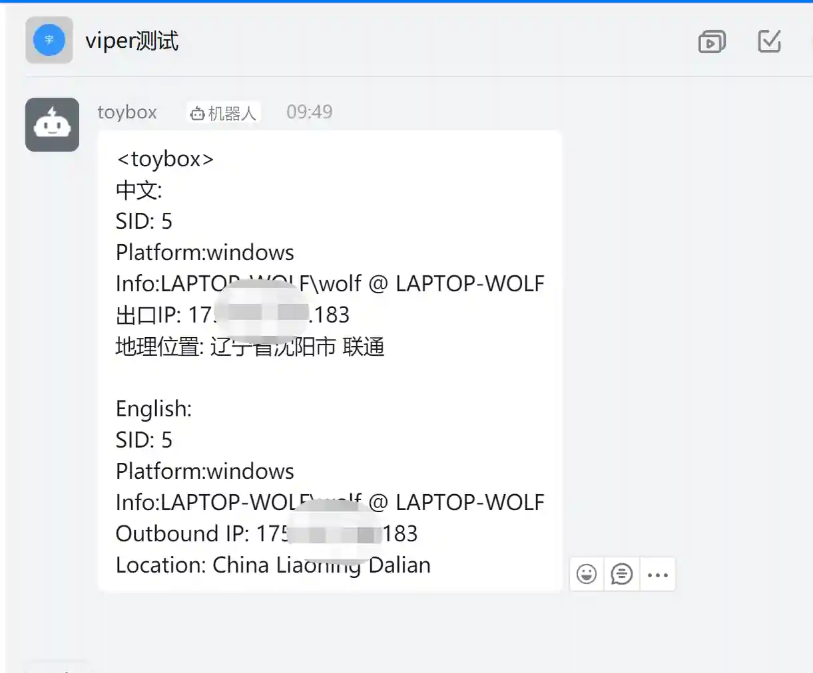

# 云函数上线通知配置方法

## 云函数配置

云函数上线具体配置方法[云函数上线](./cloud_function_online)

本篇文章主要讲解上线自动通知目标IP地址功能在Viper中的配置方法.

## VIPER配置

### 准备条件

确保云函数可以正常上线

另外可以通过下面的模块便捷的生成一个云函数的虚拟监听,用于生成载荷

### 配置一个Bot

这里以DingDing进行说明,server酱和telegram同理.

### 配置自动编排

### 上线测试

此时如果有Session上线就会自动通知IP地址到DingDing群

