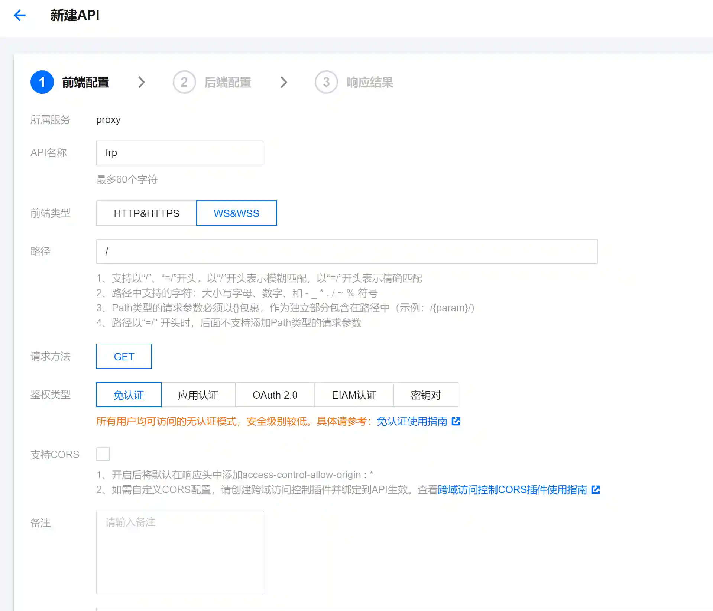
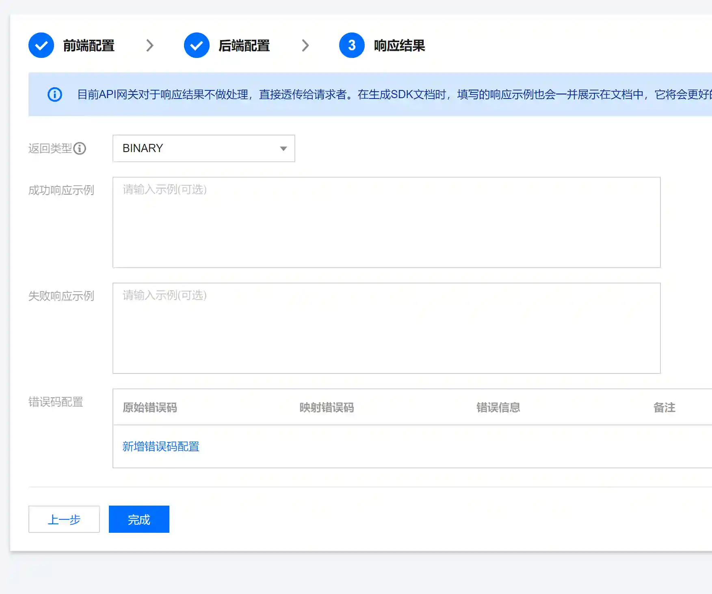

# frp与云函数结合进行内网穿透

## 目的
frp等内网穿透工具是在内网渗透过程中常用的工具,但是由于各种流量检测设备的存在,红队评估过程中经常会出现报警问题,如果使用常规的VPS结合frp的方法,就意味着vps的ip地址暴露,有被溯源分析的风险.

本文通过将frp与云函数结合达到反溯源的目的.

## 操作方法
### 腾讯API网关配置
+ 打开API网关配置页面[https://console.cloud.tencent.com/apigateway/service?rid=8](https://console.cloud.tencent.com/apigateway/service?rid=8)
+ 新增一个服务

+ 新增一个通用API

这里要注意后端域名为VPS的ip地址,端口为frps的监听端口

+ 记录API网关分配的域名

### Frp配置
+ frps配置

这里的8080端口和ip地址要与API网关的后端配置相同.

+ frpc配置

server_addr填写api网关的网址

server_port固定为80

上图配置是内网192.168.146.130的22端口映射到vps的6000端口

## 传输效率
此种方式的网络传输效率远高于CS的socks4a及msf的socks4a等.(因为CS和msf的socks4a中传输流量需要加入到C2控制协议中,效率很慢)

网络带宽大小取决于VPS本身带宽(带宽基本可以满载)

