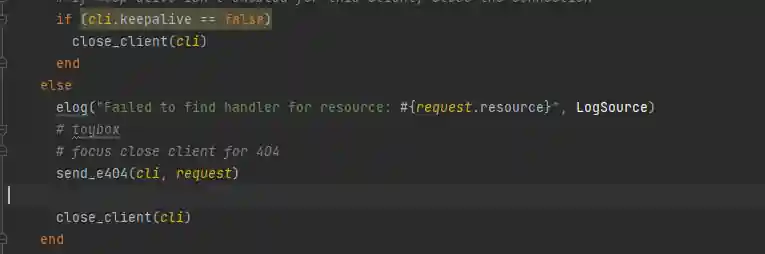
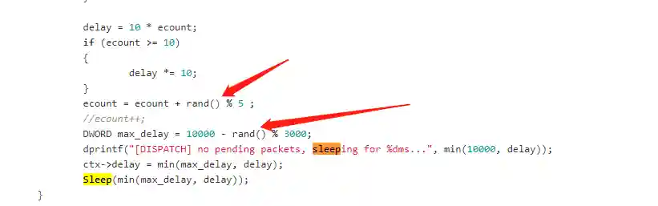

# 如何改造MSF Meterpreter如CS Beacon一样稳定

# 前言
Metasploit-Framework和Cobalt Strike是当前红队模拟中最流行的两款渗透平台.Metasploit-Framework使用Meterpreter作为其后渗透工具,Cobalt Strike对应的工具是Beacon.

在用户口碑和实际使用情况来看,Cobalt Strike的Beacon更受国内用户的青睐.除了Cobalt Strike提供友好的图形界面这一因素,大多数用户都认为Beacon相较于Meterpreter更加稳定,权限不容易丢失.

# Meterpreter与Becaon的差异在哪里
这里我们选取实战中最常用的windows/beacon_http/reverse_https(Cobalt Strike)和windows/meterpreter/reverse_https(Metasploit-Framework)进行比较

## 核心库加载
两者都支持stager和stagerless两种方式加载payload,实现方式也基本一致.

+ Meterpreter的加载顺序: stager--> metsrv.dll -->stdapi.dll
+ Becaon的加载顺序:stager-->beacon.dll

可以看出同样可以执行基本命令时,Meterpreter需要多加载一个stdapi.dll文件.

## C2实现方式
这里的C2指的是Meterpreter的Hander和Beacon的Listener.

+ Meterpreter的handler实现: TCPServer结合resources实现的简易http服务
+ Beacon的Listener实现: 基于NanoHTTPD实现.

相较于成熟的NanoHTTPD,自行实现的http服务可能在稳定性上有一定的劣势.

## 通讯协议
两者都使用https进行数据通讯,但在具体的传输方式上存在差异.

+ Meterpreter使用Http1.1,默认使用keep-alive功能,且不能关闭.
+ Beacon使用Http1.1,默认不开启keep-alive功能.

具体的表现为在实际使用过程中,Meterpreter与C2服务器始终保持一条TCP连接,且对TCP连接的状态没有监控.

相对应的Beacon在请求任务/返回结果时会与C2建立连接,而在sleep阶段与C2没有网络连接.

# 如何改造Meterpreter
## 核心库加载优化
核心库加载的改造是最简单的,或者说算不上改造.Metasploit-framework本身支持不自动加载stdapi.dll,只要在生成Handler时间AutoLoadStdapi参数设置为False就可以.

此时如果有payload连接该监听,效果如下:

具体表现是该Session很像一个假session,我们需要进入meterpreter然后执行load stdapi手动加载核心库.

此时该Session就可以正常使用了.

## C2实现方式优化
Meterpreter自行实现简易的http服务,笔者认为主要有以下几点考虑:

+ 实现reverse类型的hander代码上的统一
+ 更加灵活的进行服务启动/关闭
+ 更好的与Rex::Socket库进行结合(Rex::Socket实现了内网路由这一核心功能)

所以我们能做的就是修复http服务在各种场景上出现的问题(Bug)

**举个例子**:

如果你在VPS建立一个reverse_https的handler且端口为443这种常用端口,你就会发现有很多扫描器会扫描你的handler,导致出现很多无效的网络连接,如果你碰巧还没有设置LURI,那还会产生很多的假Session.

具体原因在于如下一段代码:

[https://github.com/rapid7/metasploit-framework/blob/master/lib/rex/proto/http/server.rb#L372](https://github.com/rapid7/metasploit-framework/blob/master/lib/rex/proto/http/server.rb#L372)

可以看出对于非法请求,虽然MSF会返回404页面(372行),但是如果对方设置keep-alive header,MSF就不会主动关闭该TCP连接,导致端口上出现很多无效的网络连接,进而影响真正的payload连接.

而解决这个Bug的代码如下:

也就是非法请求默认关闭连接.

## 通讯协议改造
笔者认为这是两者最大的差别,也是导致meterpreter看上去不稳定的直接原因.

我们希望改造以后的Meterpreter逻辑是这样的:

+ 在数据加载阶段,使用keep-alive长连接,保持传输速度
+ 在休眠阶段,使用短链接,保持隐蔽,并且可以在网络连接闪断时可以自动恢复(http短链接特性)

具体需要修改如下代码:

[https://github.com/rapid7/metasploit-payloads/blob/master/c/meterpreter/source/metsrv/server_transport_winhttp.c#L157](https://github.com/rapid7/metasploit-payloads/blob/master/c/meterpreter/source/metsrv/server_transport_winhttp.c#L157)

这个函数用于http请求,改造后的代码如下

我们在代码中增加额外的判断,如果心跳间隔(delay)大于3秒,则关闭keep-alive功能.

## 心跳抖动特性
Cobalt Strike的心跳是可以增加抖动功能的,也就是说sleep时间并不是一个固定值,而是在一个范围内浮动,结果就是Beacon请求C2的时间是随机的,可以在一定程度上规避检测.

meterpreter也可能通过修改源代码的方式支持这种特性,代码如下:

[https://github.com/rapid7/metasploit-payloads/blob/master/c/meterpreter/source/metsrv/server_transport_winhttp.c](https://github.com/rapid7/metasploit-payloads/blob/master/c/meterpreter/source/metsrv/server_transport_winhttp.c#L157)

 其中ecount是心跳增长因子,max_delay是最大心跳间隔,我们通过在这两个值上增加随机数,就实现了心跳抖动功能.

# 工程化实现
文章中涉及的所有代码定制化更改已经合入到如下仓库

[https://github.com/FunnyWolf/vipermsf](https://github.com/FunnyWolf/vipermsf)

