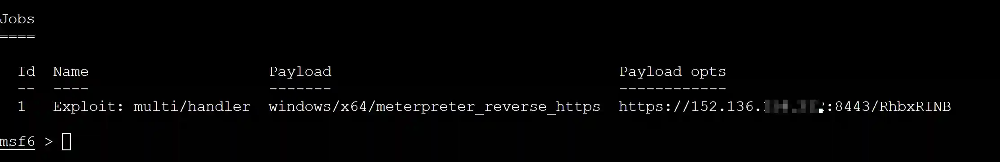
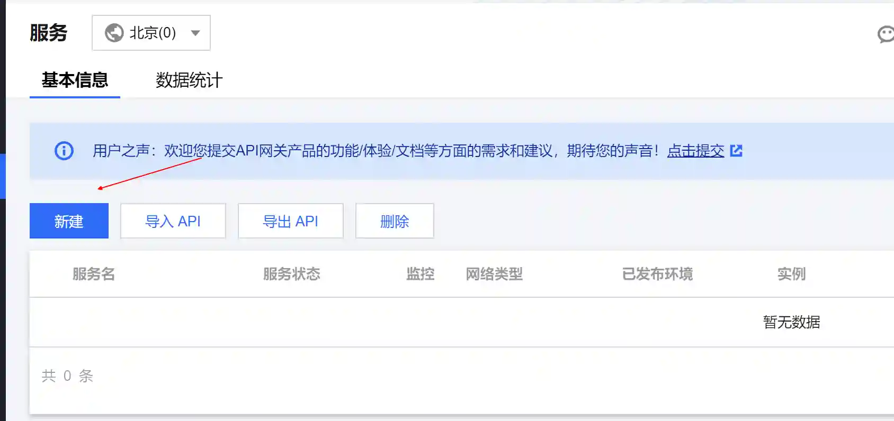
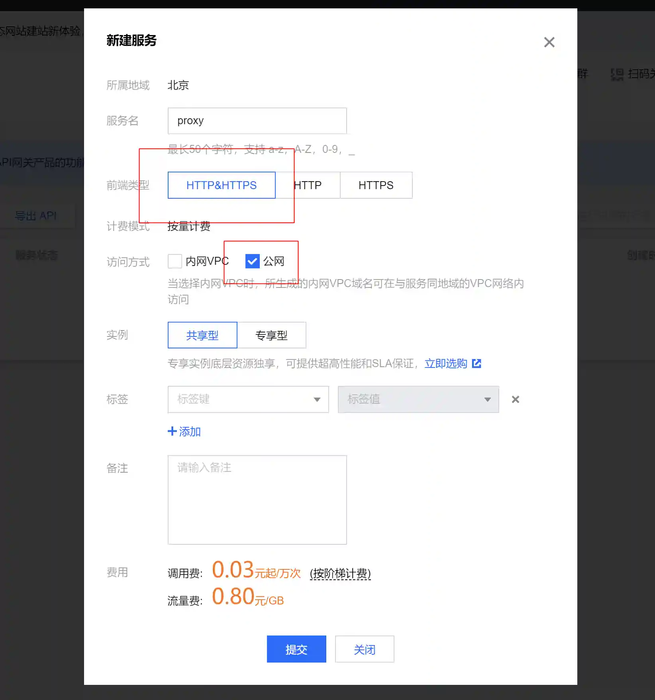
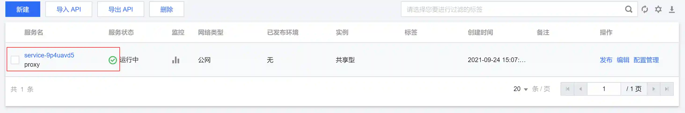
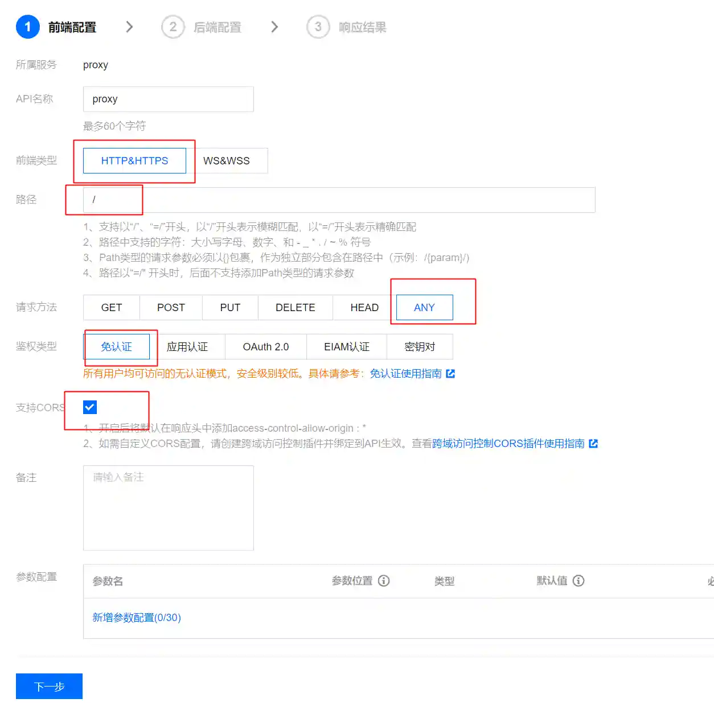
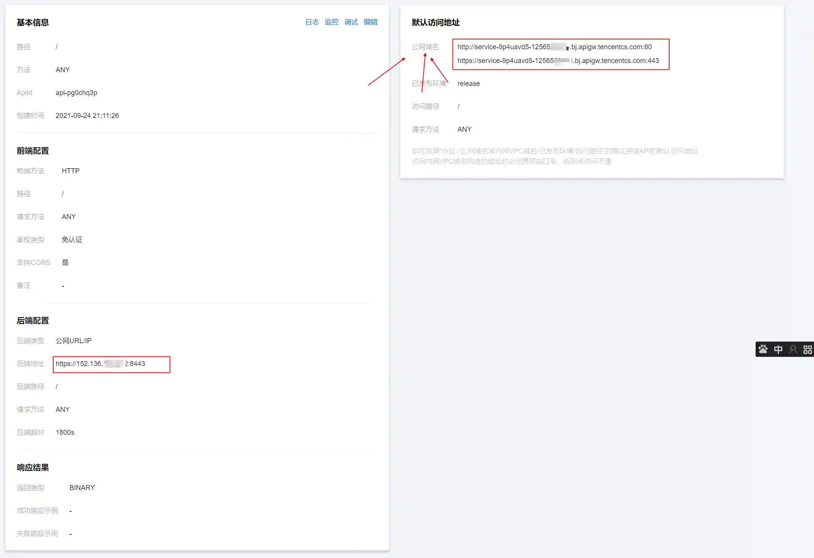
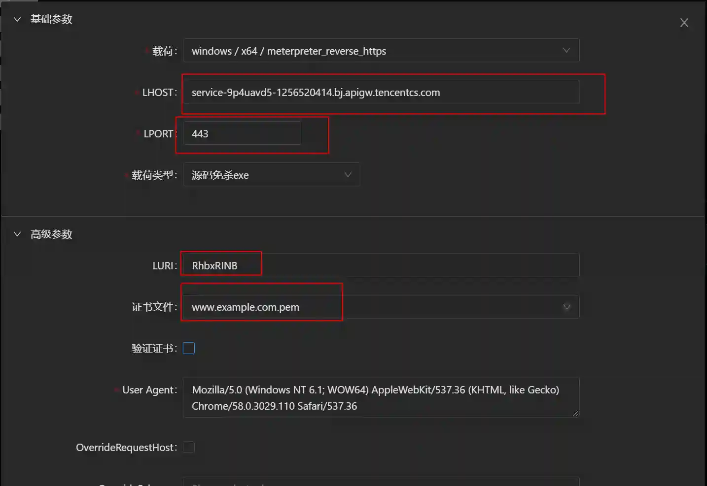
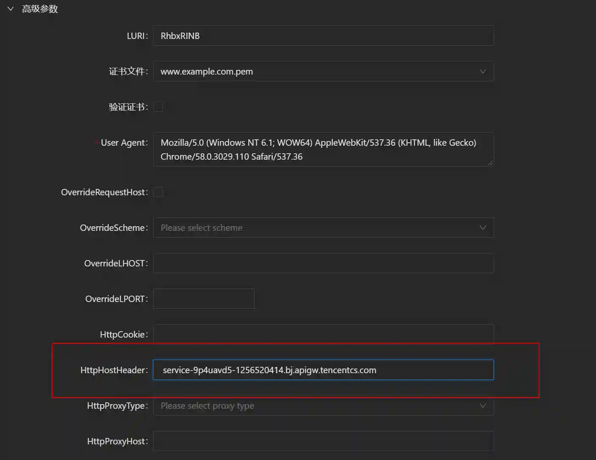
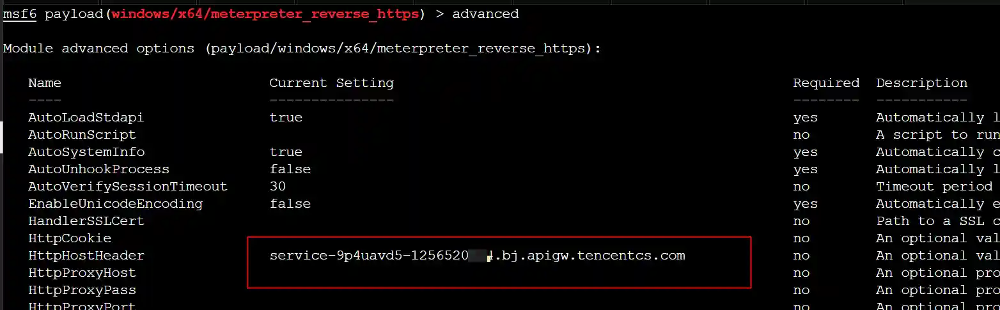

# 如何在MSF中高效的使用云函数

在攻防对抗过程中,使用云函数来隐藏C2是一种常见的手法,互联网也有很多教程来指导如何配置,但目前公开的文章中都是介绍如何在<font style="color:rgb(18, 18, 18);">CobaltStrike中使用云函数,还没有文章介绍如何在metasploit-framework中使用.</font>

<font style="color:rgb(18, 18, 18);">本文详细介绍在metasploit-framework中云函数的使用方法及相关技巧,希望通过本文能够对红队同学在红蓝对抗过程中有所帮助。</font>

<font style="color:rgb(18, 18, 18);"></font>

# 原始配置方法
> 此处使用Viper的操作方法进行说明,在metasploit-framework中参考对应配置参数即可
>

### 配置监听(Handler)


+ 一定要选择windows/meterpreter_reverse_https类型的监听,不能选择windows/meterpreter/reverse_https类型监听.

> windows/meterpreter/reverse_https需要网络传输stager,stager内容在经过云函数的转发过程中会进行编码转换,导致加载失败,而windows/meterpreter_reverse_https已经将stager内置在exe文件中.
>

+ LPORT尽量选择443/8443等常用的端口,确保不会被屏蔽.


**效果如下:**




### 配置云函数
+ 打开API网关页面 [https://console.cloud.tencent.com/apigateway/service?rid=1](https://console.cloud.tencent.com/apigateway/service?rid=1)
+ 新建一个API网关



+ 选择`公网`类型



+ 点击新建的服务,进入配置界面




+ 新建一个`通用api`,配置如下图



+ 请求方法选择ANY是因为meterpreter使用GET请求获取命令,POST请求回传结果.


+ 后端域名中填写监听的IP地址及端口,后端路径填写为/


+ 响应结果中选择BINARY类型,因为在使用meterpreter进行上传下载文件时传输的是二进制文件
+ 配置成功的效果如下图



+ 公网域名信息需要记录下来,后续会用到

### 生成配套的载荷(Payload)
+ 载荷按照如下配置,点击生成exe



+ metasploit-framework中配置方法


+ LHOST填写为云函数的域名
+ LPORT固定填写为443
+ 如果在监听(Handler)中配置了LURI及证书,这里需要和监听配置的一样

### 运行上线


### 原理解析
上文中使用云函数上线在原理上并不复杂,可以理解为将云函数作为https的反向代理使用.


# 对抗域名封禁
相比于CDN,域前置等老派隐藏C2的方法,云函数在方便性及速度上都有优势,所以在最近几次HW行动中很多红队人员都在使用,防守方对此也格外关注.

其中防守方最常见的方法就是在HW期间直接封禁类似*.apigw.tencentcs.com这种域名,禁止解析访问.

或者设置对应告警,一旦红队人员使用云函数上线,防守方马上就能定位到哪台机器已经失陷,然后修复漏洞.

接下来介绍如何对抗蓝队的域名封禁.

### 获取云函数网关IP
+ 打开[https://www.ping.cn/dns](https://www.ping.cn/dns),将云函数域名输入后查询.


+ 选择一个云函数官方服务器的IP地址,这里选择140.143.51.244

### 生成配套的载荷(Payload)
+ 载荷按照如下配置,点击生成exe




+ metasploit-framework中配置方法




+ LHOST填写为140.143.51.244(云函数网关)
+ HttpHostHeader填写为云函数的域名

### 运行上线


### 原理解析
这种方式上线与原始配置方法的区别在于载荷(payload)并不会访问域名*[.apigw.tencentcs.com](http://service-9p4uavd5-1256520414.bj.apigw.tencentcs.com/),也不会在目标网络产生相关的DNS记录,也就绕过了针对域名的封禁.

因为云函数网关在转发https请求时是根据http消息头中Host字段进行转发,所以我们将云函数域名直接填写在http消息头的host字段中,然后将http请求通过IP地址方式直接发送到云函数网关,同样可以达到反向代理的效果.

# 获取真实IP
### 云函数的缺陷
在使用云函数隐藏C2时都会遇到一个问题,就是无法获取到目标机的网络出口IP地址.


上图中session 3是直接上线时的效果,可以看到我们可以通过目标主机的互联网出口IP进行地理位置定位.

session 1是使用云函数上线时的效果,只能获取到云函数的网关IP.

如果在HW或红队评估过程中,红队人员是通过广撒网钓鱼的方式投递载荷,C2服务可能会收到很多来自云沙箱的Session,因为Session的IP地址固定为云函数网关IP,红队人员就无法确定该Session是否有效.

### 获取真实IP
互联网有很多在线接口可以查询自己的公网ip地址,比如[https://ifconfig.io/ip](https://ifconfig.io/ip)


通过session访问[https://ifconfig.io/ip](https://ifconfig.io/ip),我们就可以获取到session真实的ip地址.

poweshell代码

```plain
$WebRequest = [System.Net.WebRequest]::Create("http://ifconfig.io/ip")
$WebRequest.Method = "GET"
$WebRequest.ContentType = "application/json"
$Response = $WebRequest.GetResponse()
$ResponseStream = $Response.GetResponseStream()
$ReadStream = New-Object System.IO.StreamReader $ResponseStream
$Data = $ReadStream.ReadToEnd()
Write-Host $Data
```

执行效果


### 自动化通知
在攻防对抗中,如果使用鱼叉钓鱼的方式投递载荷,红队人员想要在获取到session后第一时间得到通知,然后判断session是不是有效的,那自动化通知的方式就必不可少.

大致的流程如下:

+ 配置云函数隐藏C2,确保自己不被溯源
+ 获取到session后自动获取真实ip
+ 将session的相关信息及获取到的真实ip通过消息通知的方式发送到手机

我们来看一下最终效果:


# 结语
攻防对抗过程中很多红队技术并不复杂,但是在提升技术的可用性和工程化落地方面也是很有必要且很有挑战的一件事.希望本文对各位红队同学在使用云函数时有所帮助.


