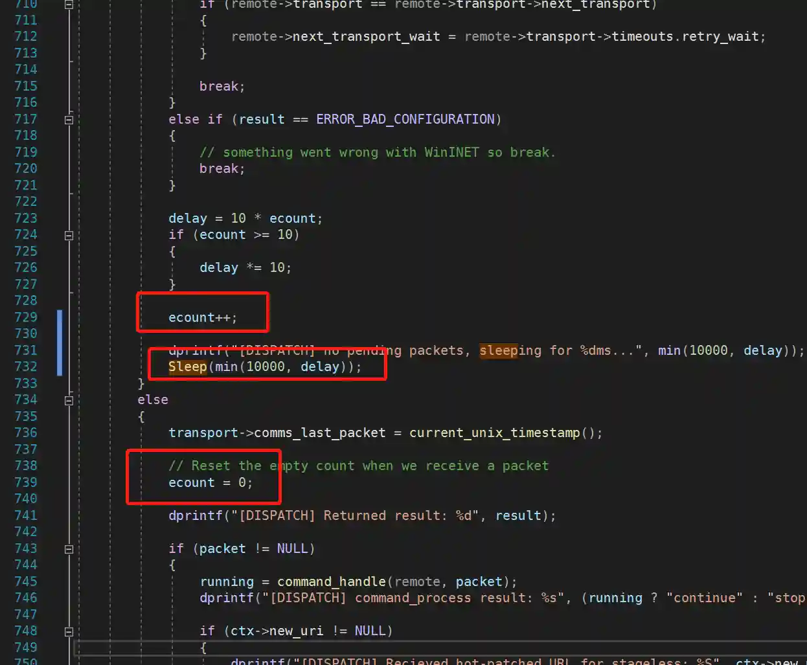

# MSF sleep与CobaltStrike sleep

## 前言
metasploit-framework和cobalt strike(简称CS)是当前主流的两个红队评估工具.

在红队评估过程中为了尽可能的降低暴露的风险,减少通讯流量是基本需求.巧合的是CS和metasploit-framework都是使用sleep命令进行通讯间隔控制.(MSF是在2015年[pr链接](https://github.com/rapid7/meterpreter/pull/158)加入,CS应该是在2.13版本加入).

两者实现的方法应该大同小异,但是呈现的效果有所区别.


## Cobalt Strike sleep
因为cobalt strike不开源,无法从代码层分析sleep原理.

从效果上看Cobalt Strike sleep实现了beacon的通讯间隔控制.beacon中调用系统sleep进行休眠,teamserver实现一种消息队列,将命令存储在消息队列中.当beacon连接teamserver时读取命令并执行.

当然因为没有分析代码,以上都是从功能上进行的猜测.


## MSF Sleep
因为metasploit-framework和meterpreter都是开源的,所以我们可以从源码中分析sleep是如何工作与实现的.

### Sleep效果


+ metasploit-framework的sleep会直接让session处于休眠状态,在UI上表现为session关闭,
+ session指定时间后重新连接(handler未删除的情况下).
+ session在重新连接后通讯间隔并不会改变

### Sleep on Metasploit-framework
Metasploit-framework代码主要来源于这个pr [链接](https://github.com/rapid7/metasploit-framework/pull/5339)

代码中主要分为两个部分,一部分是UI上的命令处理/帮助处理等

```ruby
  def cmd_sleep_help
    print_line('Usage: sleep <time>')
    print_line
    print_line('  time: Number of seconds to wait (positive integer)')
    print_line
    print_line('  This command tells Meterpreter to go to sleep for the specified')
    print_line('  number of seconds. Sleeping will result in the transport being')
    print_line('  shut down and restarted after the designated timeout.')
  end

  #
  # Handle the sleep command.
  #
  def cmd_sleep(*args)
    if args.length == 0
      cmd_sleep_help
      return
    end

    seconds = args.shift.to_i

    if seconds <= 0
      cmd_sleep_help
      return
    end

    print_status("Telling the target instance to sleep for #{seconds} seconds ...")
    if client.core.transport_sleep(seconds)
      print_good("Target instance has gone to sleep, terminating current session.")
      client.shutdown_passive_dispatcher
      shell.stop
    else
      print_error("Target instance failed to go to sleep.")
    end
  end
```

第二部分是具体发送到meterpreter的TLV控制

```ruby
  def transport_sleep(seconds)
    return false if seconds == 0

    request = Packet.create_request('core_transport_sleep')

    # we're reusing the comms timeout setting here instead of
    # creating a whole new TLV value
    request.add_tlv(TLV_TYPE_TRANS_COMM_TIMEOUT, seconds)
    client.send_request(request)
    return true
  end
```

### Sleep on Meterpreter
Meterpreter的代码主要来源于这个pr [链接](https://github.com/rapid7/meterpreter/pull/158/files)

因为[https://github.com/rapid7/meterpreter](https://github.com/rapid7/meterpreter)已经废弃,我们后续代码都依据[https://github.com/rapid7/metasploit-payloads](https://github.com/rapid7/metasploit-payloads)进行分析.

除了常规的TLV控制外,代码的主体部分如下

```c
				// transport switching and failover both need to support the waiting functionality.
				if (remote->next_transport_wait > 0)
				{
					dprintf("[TRANS] Sleeping for %u seconds ...", remote->next_transport_wait);

					sleep(remote->next_transport_wait);

					// the wait is a once-off thing, needs to be reset each time
					remote->next_transport_wait = 0;
				}

```

可以看到最终实现是使用sleep进行休眠.


### 休眠-重新连接流程原理
实现休眠及重新连接的代码主要来源于ruby中的

```ruby
      client.shutdown_passive_dispatcher
      shell.stop
```

这两行,第一行是将处理http请求的线程关闭,第二行是将session关闭.


## MSF中实现Cobalt Strike的效果
笔者个人认为msf的sleep更加符合休眠隐蔽的逻辑,Cobalt Strike的通讯间隔方式依赖于队列/请求模型.但是现实情况是国内大多数安全人员更喜欢Cobalt Strike的模型,那我们能在MSF中实现Cobalt Strike效果吗?

答案是肯定的.

### MSF原生通讯间隔
其实MSF本身就带有通讯间隔控制,如果你执行 session -x,会发现checkin字段会在1-10中变化.


这是因为http类型的meterpreter会最长每10秒连接一次服务器.

10秒间隔的前提是不使用session进行操作,如果使用session进行操作后,会发现心跳间隔缩短为1秒.后续停止操作,通讯间隔会慢慢递增到10秒.

### 实现原理
我们会发现meterpreter的通讯间隔控制非常巧妙,在不操作session时增大通讯间隔,在操作session后将通讯间隔缩小到最小,保证快速获取操作结果,如果停止操作通讯间隔又会慢慢增大.这样就在减小通讯流量和操作流畅性上达到平衡.

具体的代码链接 [链接](https://github.com/rapid7/metasploit-payloads/blob/master/c/meterpreter/source/metsrv/server_transport_winhttp.c)

```c
			else if (result == ERROR_BAD_CONFIGURATION)
			{
				// something went wrong with WinINET so break.
				break;
			}

			delay = 10 * ecount;
			if (ecount >= 10)
			{
				delay *= 10;
			}

			ecount++;

			dprintf("[DISPATCH] no pending packets, sleeping for %dms...", min(10000, delay));
			Sleep(min(10000, delay));
		}
		else
		{
			transport->comms_last_packet = current_unix_timestamp();

			// Reset the empty count when we receive a packet
			ecount = 0;

			dprintf("[DISPATCH] Returned result: %d", result);

```





### 模拟Cobalt Strike效果
如果要模拟Cobalt Strike效果,其实只要修改Sleep(min(10000, delay))中的delay就可以了,那我们怎么实现动态控制呢?为了尽量少改动代码,我们先借用已有的功能来帮助我们实现.

meterpreter中set_timeout是控制session的超时时间参数,我们可以借用这个参数中的wait time来实现通讯间隔控制.


代码如下:

```c
			delay = 10 * ecount;
			if (ecount >= 10)
			{
				delay *= 10;
			}

			ecount++;
			if (transport->timeouts.retry_wait > 60) {
				dprintf("[DISPATCH] no pending packets, sleeping for %dms...", transport->timeouts.retry_wait * 1000);
				Sleep(transport->timeouts.retry_wait*1000);
			}
			else {
				dprintf("[DISPATCH] no pending packets, sleeping for %dms...", min(10000, delay));
				Sleep(min(10000, delay));
			}
```

当retry_wait大于60时,我们就使用retry_wait作为通讯间隔参数,

+ 编译代码
+ 将生成的metsrv.x64.dll上传到metasploit-framework/data/meterpreter/
+ 重新生成session
+ 进入session后执行 set_timeout -w 61


+ 我们看到通讯间隔大于10了
+ 在checkin大于55时执行set_timeout -w 10,可以恢复原有通讯间隔.(因为meterpreter命令默认超时时间为10秒,所以要在checkin大于50的时候操作)


## 总结
Cobalt Strike和MSF在sleep实现上应该大同小异,只不过呈现的效果不同,因为MSF是开源的,我们还可以通过自定义代码来实现自定义通讯间隔的功能.


