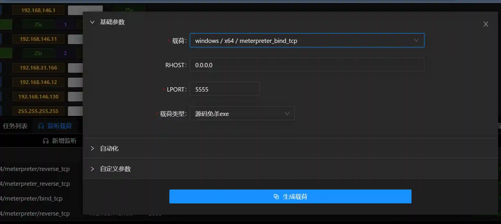

# 多级内网渗透(原生隧道)

## 什么是多级内网

标题中所说的多级内网,常见于各种大型企业.举个例子,如下图

A网中一般是企业的DMZ区,里面有对外的web服务器,dns服务器等.

B网中一般是企业内网的服务器区,里面有域控服务器,内网OA等.

C网中一般是企业红区,里面有敏感信息存储的数据库,或者各种关键业务服务器.(比如医院的HIS,工业企业的工业控制器等)

这种网络中,A网可以连接互联网,B网可以连接A网和C网但是无法连接互联网,C网只能连接B网.

## 如何用Viper渗透多级内网

当前互联网绝大多数介绍msf进行多级内网渗透都是使用内网路由/端口转发或者借助第三方工具的方式进行网络流量转发.

本篇介绍在Viper中如何使用原生session通讯通道的方式进行内网渗透,这种方式操作最简单,也相对稳定,其原理类似Cobalt Strike原生的多级转发功能,Viper中该功能更加强大(
支持正向/反向连接,支持Windows及Linux)

实验环境网络配置如下:

+ 上线192.168.146.1

+ 使用meterpreter_reverse_tcp,通过192.168.146.1的Session上线192.168.146.11

> 按照如下配置新建监听
>

> 生成载荷,在192.168.146.11上执行
>

> 可以看到新生成的Session在最后有连接标志,表示Session 2是通过Session 1转发上线的
>

+ 使用meterpreter_bind_tcp,通过192.168.146.11的Session上线192.168.146.12

> 按照如下配置生成载荷,并在192.168.146.12上执行
>

> 新建监听,上线
>

> 红框表示Session 3是通过Session 2上线的
>

+ 网络拓扑

+ 载荷支持列表:

Windows/Linux

meterpreter_reverse_tcp

meterpreter_reverse_http

meterpreter_reverse_https

meterpreter/bind_tcp

meterpreter_bind_tcp

