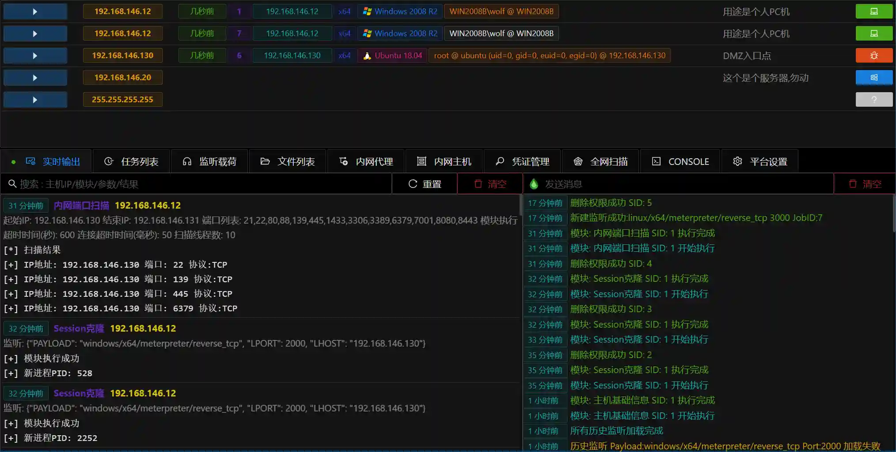
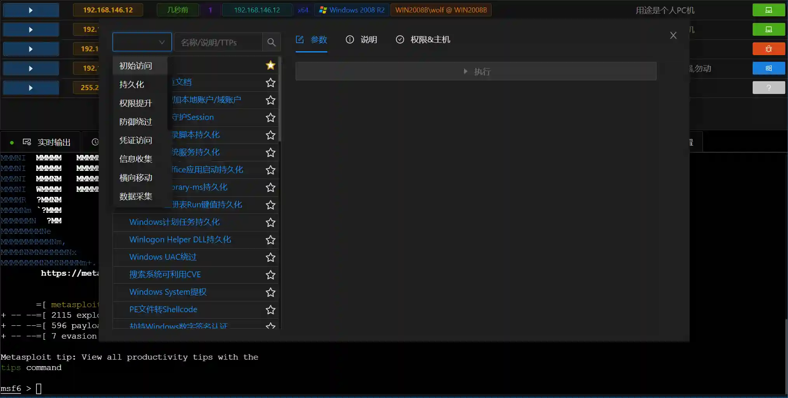
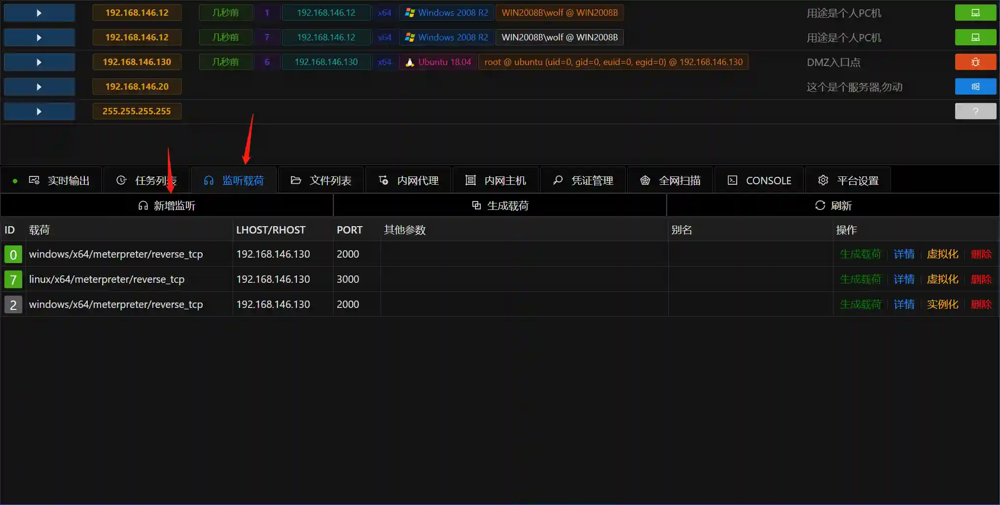
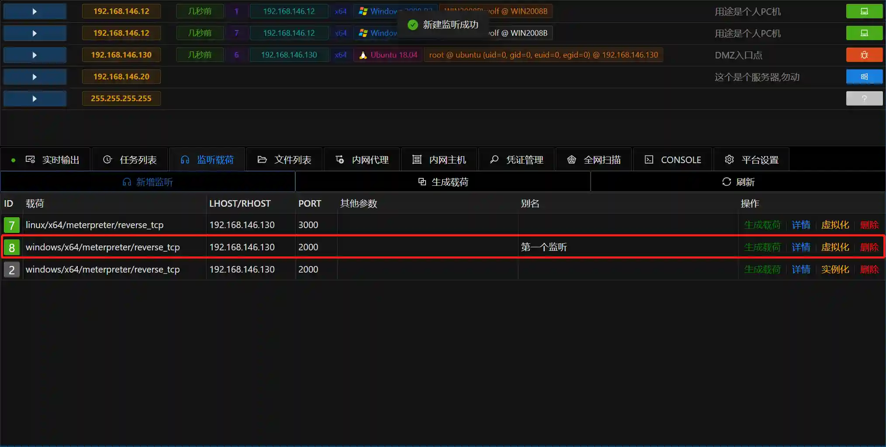
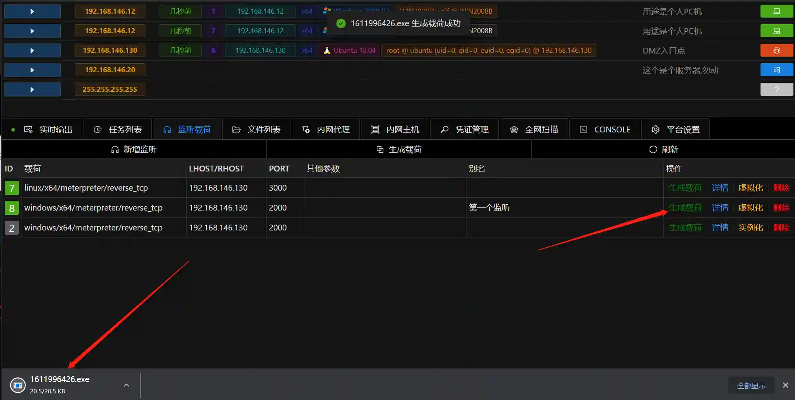
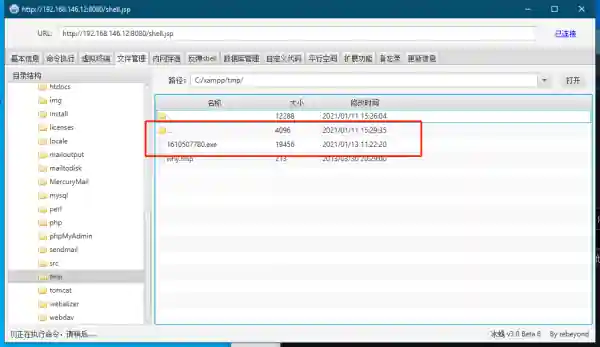
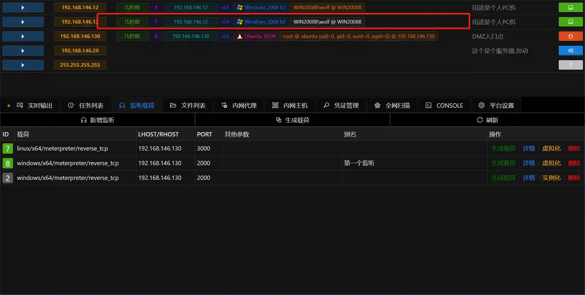
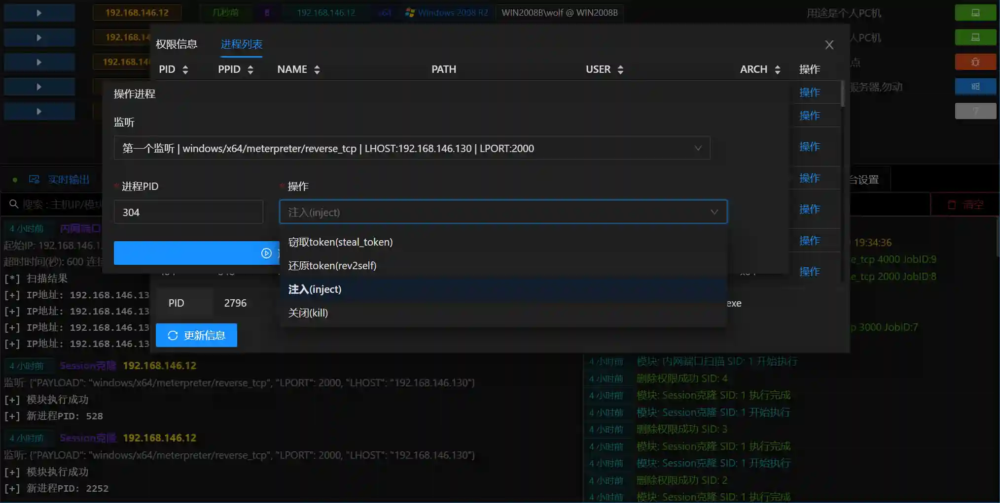
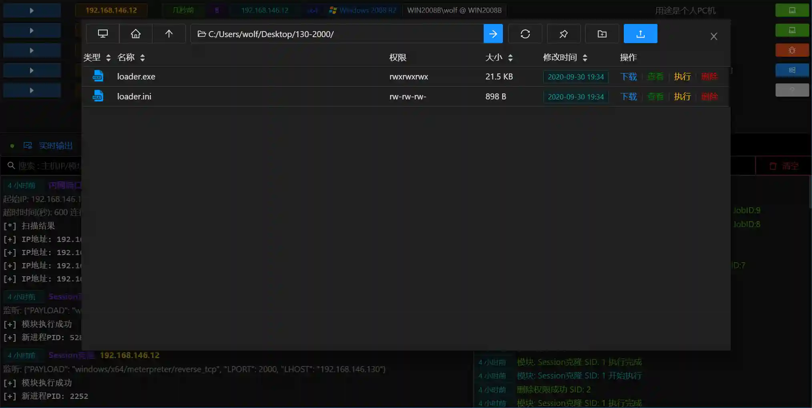

# Viper:开源的图形化内网渗透工具 - 安装及入门






<font style="color:#39434C;"></font>

# 简介
+ Viper是一款图形化内网渗透工具,将内网渗透过程中常用的战术及技术进行模块化及武器化.
+ Viper基础功能已集成杀软绕过,内网隧道,文件管理,增强命令行等基础功能.
+ Viper通过模块的方式落地<font style="color:#39434C;">MITRE ATT&CK中的常用技术.</font>当前已集成55个模块,覆盖初始访问/持久化/权限提升/防御绕过/凭证访问/信息收集/横向移动等大类.
+ Viper可以帮助你以直观/可视化的方式使用metasploit-framework.
+ 项目地址: [https://github.com/FunnyWolf/Viper](https://github.com/FunnyWolf/Viper)

# 安装
Viper采用Browser/Server架构,服务器加载Docker镜像后,使用浏览器即可使用


+ 准备一台linux系统的 VPS或虚拟机,首次使用建议使用虚拟机
+ 安装 docker及docker compose

```shell
apt-get update
curl -sSL https://get.daocloud.io/docker | sh
service docker start
curl -L https://get.daocloud.io/docker/compose/releases/download/1.25.5/docker-compose-`uname -s`-`uname -m` > /usr/local/bin/docker-compose
chmod +x /usr/local/bin/docker-compose`
```

+ 如果 VPS 或虚拟机内存小于 2G,需要增加 2G 虚拟内存

```shell
dd if=/dev/zero of=/root/swapfile2 bs=1M count=2048
chmod 0600 /root/swapfile2
mkswap /root/swapfile2
swapon /root/swapfile2
```

+ 执行如下命令生成docker-compose.yml, **<font style="color:#F5222D;">diypassword 替换为自定义密码</font>**

```shell
mkdir -p /root/viper
cd /root/viper
tee docker-compose.yml <<-'EOF'
version: "3"
services:
  viper:
    image: registry.cn-shenzhen.aliyuncs.com/toys/viper:latest
    container_name: viper-c
    network_mode: "host"
    restart: always
    volumes:
      - /root/viper/loot:/root/.msf4/loot
      - /root/viper/db:/root/viper/Docker/db
      - /root/viper/module:/root/viper/Docker/module
      - /root/viper/log:/root/viper/Docker/log
    command: ["diypassword"]
EOF
```

+ 执行如下命令启动VIPER,首次启动会自动下载docker image

```shell
docker-compose up -d
```

+ 等待系统启动(15s),使用浏览器访问 [https://vpsip:60000](https://vpsip:60000/#/user/login) 登录服务器. 用户名:root 密码:**<font style="color:#F5222D;">自定义密码</font>**


# 入门
本章节从介绍如何创建第一个权限开始,介绍权限最常用的 **信息查看** **文件管理 命令终端 **三个功能,帮助使用者快速熟悉Viper.

## 获取第一个权限
在内网渗透中,一个内网中稳定的立足点是所有后续操作的开始与基础

+ 选择 **监听载荷-新增监听** ,进入新增监听页面




> Viper的监听基于MSF的hander,LHOST填写为服务器的IP地址,LPORT端口无特殊要求,确保未占用即可.
>

+ 成功新增监听后如下图所示



+ 点击对应监听的 **生成载荷** ,浏览器会自动下载一个免杀的exe



> 免杀载荷可能由于杀毒软件厂商添加 md5 标签而失效,<font style="background-color:transparent;">viper通过持续更新的方式对抗杀软</font>
>

+ 将生成的exe上传到要控制主机中,然后执行,下图是冰蝎webshell为例运行方法



> 或者直接拷贝到Windows虚拟机中进行测试
>

+ 此时控制台已经获取了一个 Session



## 权限操作
在获取权限之后,我们就可以使用该权限进行操作

+ 点击权限会显示功能列表


## 权限信息
+ **权限信息** 显示权限的详细的基础信息
+ 通过 `管理员权限` `UAC状态` 等字段判断是否需要提权,
+ 通过 `域` `域用户` 等字段判断是否需要进行域渗透
+ 如果使用VPS进行试验,还可以查看权限的网络连接的地理位置信息


+ **进程列表** 可以查看已控制主机的进程信息,还有当前权限所在进程的信息
+ 针对每一个进程还可以进行入住,窃取token,关闭等操作




## 文件管理
+ **文件管理** 用来 浏览/上传/下载/删除/执行 已控制主机中的文件.
+ 操作页面与Window资源管理器风格保持一致



+ 查看文件时还可以直接修改文件


+ 可以直接运行已控主机上的二进制文件,可以输入参数


+ 还可以通过点击右上角上传按钮打开 `服务器文件管理器` ,直接上传文件或查看下载的文件


+ Viper的文件传输数据流如下:

Viper用户PC <=>Viper服务器文件管理器<=>已控主机磁盘

## 命令终端
+ **命令终端** 基于meterpreter命令行
+ **命令终端** 以主机为维度存储所有历史操作记录
+ 可以通过shell+cmd的方式执行操作系统命令


# 总结
<font style="color:#39434C;">Viper在内网渗透工程化技术落地及易用性上做一些探索,</font>当前功能已经覆盖内网渗透中的大部分场景且在不断的迭代更新中,<font style="color:#39434C;">希望可以帮助到对此有需求的安全研究人员.</font>如果你正在学习内网渗透或希望定制自己的内网渗透工具,可以尝试使用Viper.

项目地址:[https://github.com/FunnyWolf/Viper](https://github.com/FunnyWolf/Viper)


