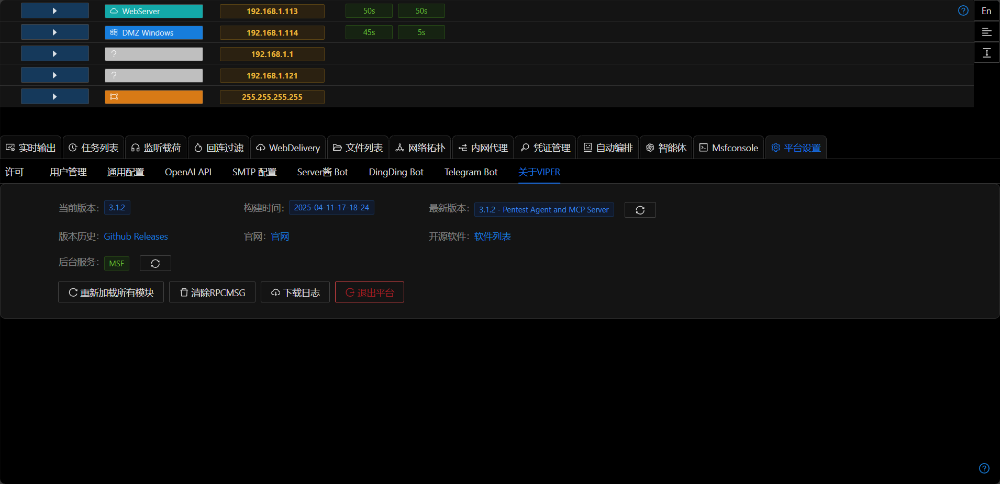

# 关于VIPER

## 最新版本
浏览器会到Github查看Viper的最新版本信息

> github针对IP有查询频率限制，查询失败时请切换浏览器代理重试

## 后台服务

更新后台MSF服务状态

## 重新加载所有模块

上传或修改自定义模块后,点击此按钮,无需重启平台即可使用修改后的模块.

## 清除RPCMSG

RPCMSG用来记录代理扫描过程中产生的消息(例如dnslog),可用此功能清除历史记录.

## 下载日志

打包下载Viper平台所有日志文件.