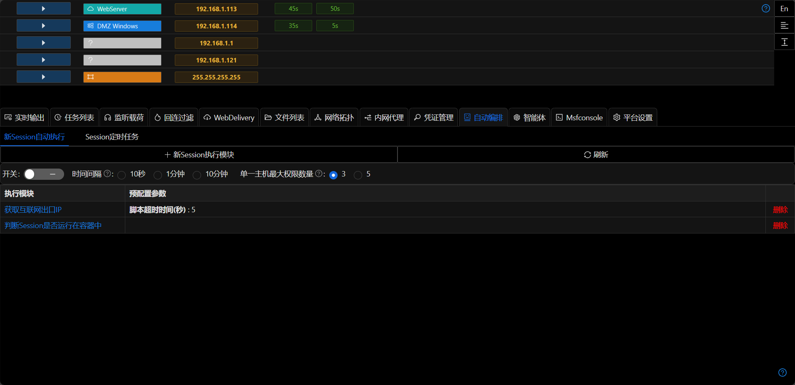
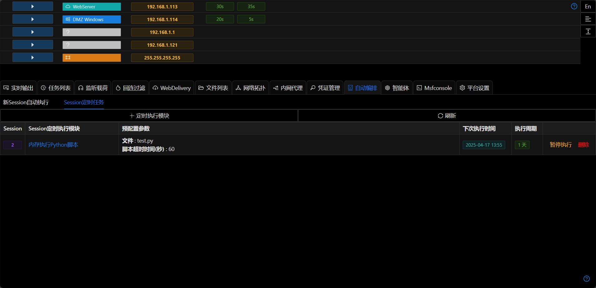

# 自动编排

## 新Session执行模块

每当有新的Session(权限)上线时,会自动按照顺序执行`自动编排`中已经配置好的模块.

+ 时间间隔

可以通过该参数设置每个模块执行的间隔时间,避免短时间内执行多个模块导致报警或不稳定

+ 单一主机最大权限数量

如果在`自动编排`中配置了会生成新的权限的模块(比如`Session克隆`),则可能会出现死循环
> 新的权限->自动编排模块->自动编排模块导致新的权限->自动编排模块>.....

在配置了该参数之后,如果系统判断单一主机(同一个内网IP)对应的权限数量大于配置数量,则自动跳过自动编排模块.

## Session定时任务模块

+ Session会按照配置信息自动化定时执行模块
+ 可以`暂停执行`/`恢复运行`

