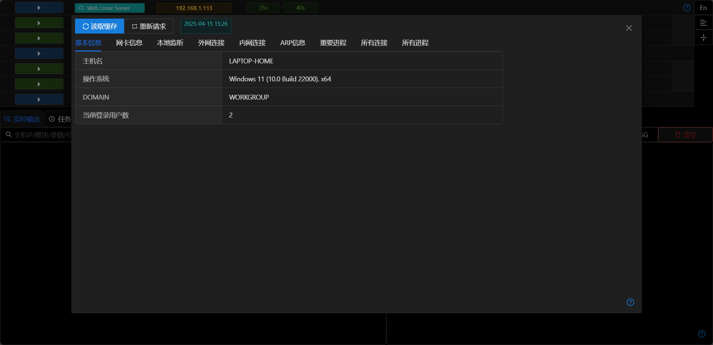
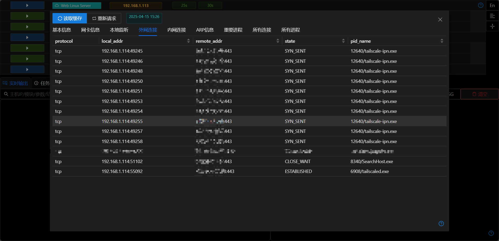
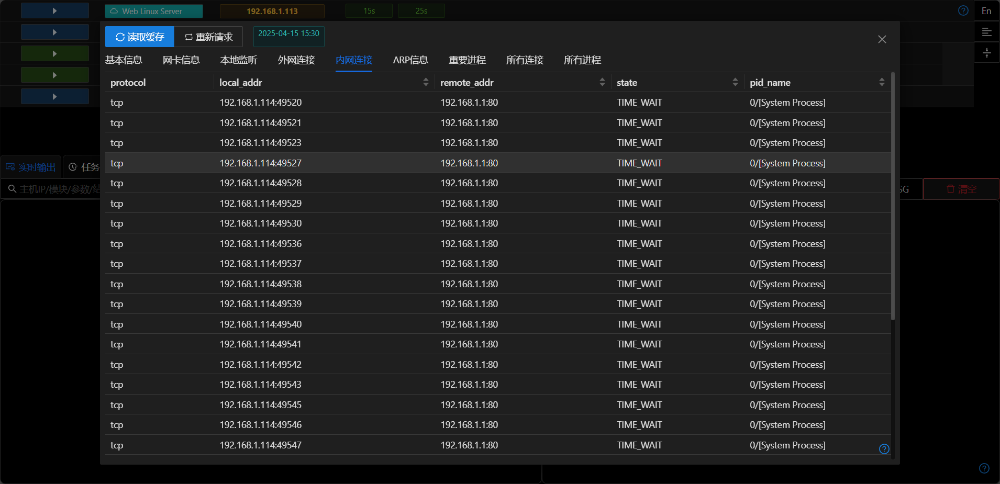
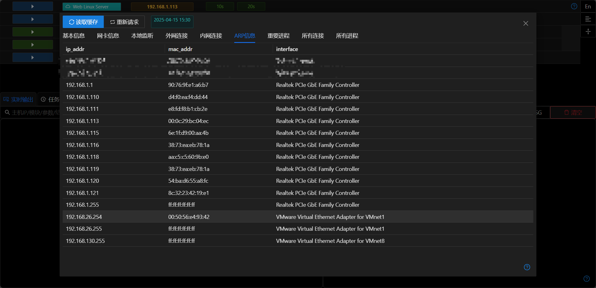
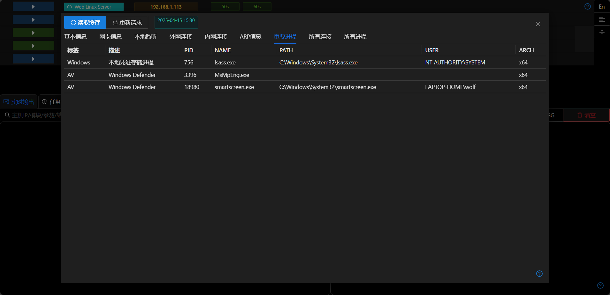

# 运行信息

## 读取缓存/重新请求

+ 每次打开窗口时会自动读取数据库中缓存的主机信息
+ 点击 `重新请求`会在后台执行更新主机信息模块,模块执行完成后自动将结果存储到数据库中.

## 外网连接

- 分析主机有哪些联网应用

## 内网连接

- 判断内网其他主机的IP地址及服务

## ARP信息

- 用于查找内网网段

## 重要进程

- 判断主机的杀软及远控软件(teamviewer/anydesk)运行情况

